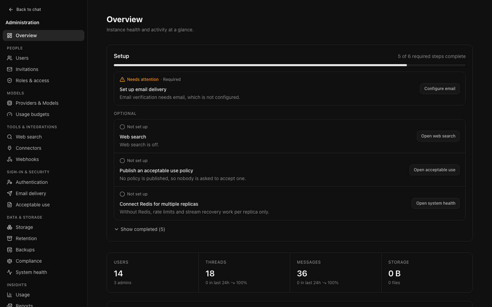
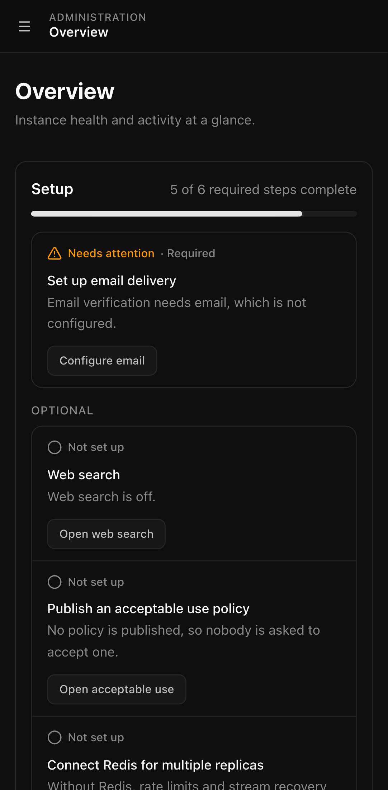
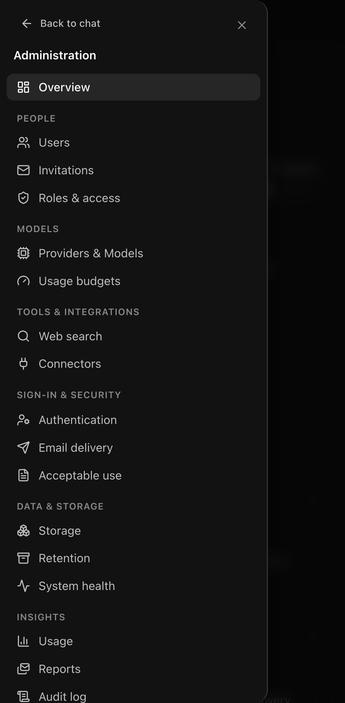

# Administering Open Chat Interface

The administrative dashboard is at `/admin`, available to accounts with the
`admin` role. An `auditor` may open every page here and change nothing: each
page shows a read-only banner, and controls that would save something are hidden
or disabled.

**Overview** opens with a setup checklist: what still has to be configured
before the instance works as intended, each item linking to the page that
resolves it. [First run](first-run.md) walks through it.

## Contents

1. [First run](first-run.md) — the setup checklist, step by step.
2. [Instance settings](instance-settings.md) — general settings, email delivery,
   branding, announcements.
3. [Identity and access](identity.md) — roles, local accounts, OIDC, group
   role mapping.
4. [People](people.md) — users, roles, bans, limits, invitations, bulk actions.
5. [Models and providers](models-providers.md) — credentials, the catalogue, the
   default model.
6. [Governance](governance.md) — roles and access, usage budgets, retention,
   acceptable use.
7. [Operations](operations.md) — system health, background jobs, storage, web
   search.
8. [Audit and reporting](audit-reporting.md) — the audit log, exports, usage,
   scheduled reports.
9. [Connectors](connectors.md) — MCP servers whose tools models can call:
   authentication, approval, network safety.
10. [Backups](backups.md) — scheduled database dumps and attachment manifests
    to S3, verification, retention, restoring.
11. [Observability and events](observability.md) — Prometheus metrics,
    OpenTelemetry traces, signed webhooks for audit events.
12. [Compliance export and legal hold](compliance.md) — audit events and,
    optionally, conversation content as JSON Lines to S3; legal holds that
    pause retention and deletion for named people.
13. [Read-only maintenance mode](maintenance.md) — keep reading, searching
    and signing in working while nothing can be changed, for a window or an
    emergency (`OCI_READ_ONLY`).

For deployment, backup, and upgrade, see [Operations](../OPERATIONS.md).

## The pages, in one line each

Pages are grouped by task. **Overview** sits above the groups.

| Page | What it is for |
| --- | --- |
| Overview | The setup checklist, activity, totals, and system status |

**People**

| Page | What it is for |
| --- | --- |
| Users | Accounts, roles, bans, sessions, limits, bulk actions |
| Invitations | Invite links when registration is closed |
| Roles & access | Everything that shapes one role: limits, storage, budgets, models, features |

**Models**

| Page | What it is for |
| --- | --- |
| Providers & Models | Upstream credentials, the model catalogue, the default model |
| Usage budgets | Consumption caps applied to roles, with per-person overrides |

**Tools & integrations**

| Page | What it is for |
| --- | --- |
| Web search | The switch for web search, its provider, and a test search |
| Connectors | MCP servers whose tools models can call, and which of their tools are enabled |
| [Webhooks](observability.md#webhooks) | HTTPS endpoints that receive selected audit events, signed and retried, with a delivery log |

**Sign-in & security**

| Page | What it is for |
| --- | --- |
| Authentication | Registration, local sign-in, sessions, and single sign-on providers |
| Email delivery | SMTP for verification, password resets, invitations, and reports |
| Acceptable use | A policy people must accept before using the instance |

**Data & storage**

| Page | What it is for |
| --- | --- |
| Storage | Where attachments live, and the upload policy |
| Retention | How long conversations, usage history, and audit entries are kept |
| [Backups](backups.md) | Daily database dumps and attachment manifests to S3, verified, with retention |
| [Compliance](compliance.md) | Audit events (and optionally conversation content) exported as JSON Lines to S3; legal holds |
| System health | Whether dependencies are working, [read-only maintenance mode](maintenance.md), background jobs, storage reconciliation, [observability](observability.md) status |

**Insights**

| Page | What it is for |
| --- | --- |
| Usage | What has been consumed, by whom, on what |
| Reports | Usage summaries delivered by email |
| Audit log | Who did what, with export |

**Appearance & features**

| Page | What it is for |
| --- | --- |
| General | The default system prompt and optional chat features |
| Branding | Name, logo, accent colour, default theme, sign-in message |
| Announcements | A banner shown to everybody |

### Old addresses

Pages that were merged keep their old URLs working. Bookmarks redirect:

| Old address | Now |
| --- | --- |
| `/admin/providers` | `/admin/models` |
| `/admin/sso` | `/admin/settings/authentication`, at the single sign-on section |
| `/admin/rate-limits` | `/admin/roles` |
| `/admin/storage-limits` | `/admin/roles` |
| `/admin/maintenance` | `/admin/health` |
| `/admin/settings` | `/admin/settings/general` |

## On a phone

The dashboard works on a narrow screen. The sidebar is replaced by a menu
button at the top of the page, which opens the same grouped navigation in a
drawer; it closes again when you pick a page. Reading a figure or acknowledging
an announcement is comfortable; configuring a provider is not, and is better
done at a desk.

## The shape of the interface

Every page follows the same pattern: a heading explaining what it is for, then
the controls. Lists that can grow — users, audit entries — filter on the server,
so a search describes everything rather than the page in front of you.

Anything with a consequence that is not obvious from its label says so in place,
rather than leaving you to find out here.
