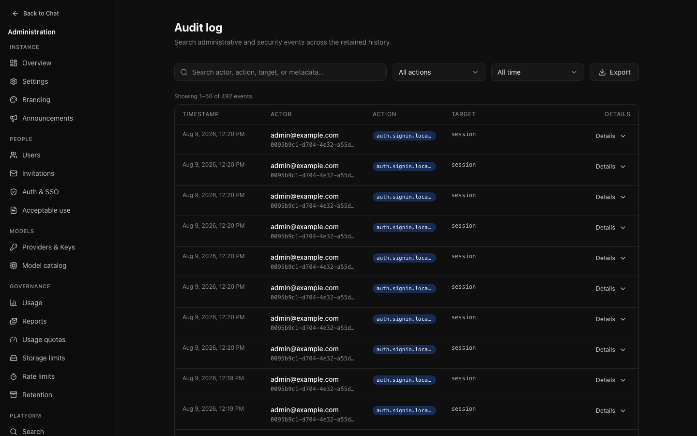
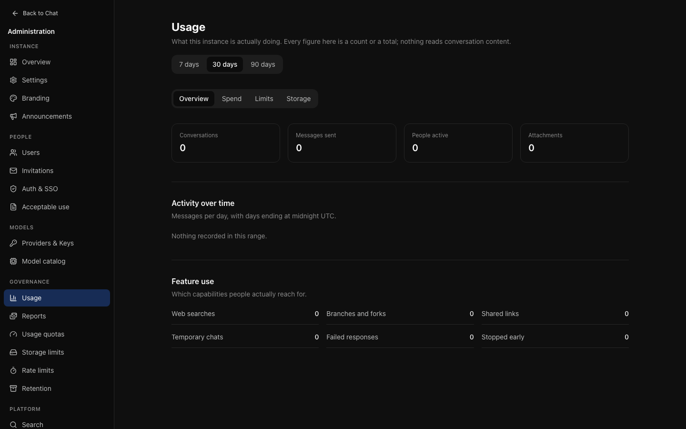
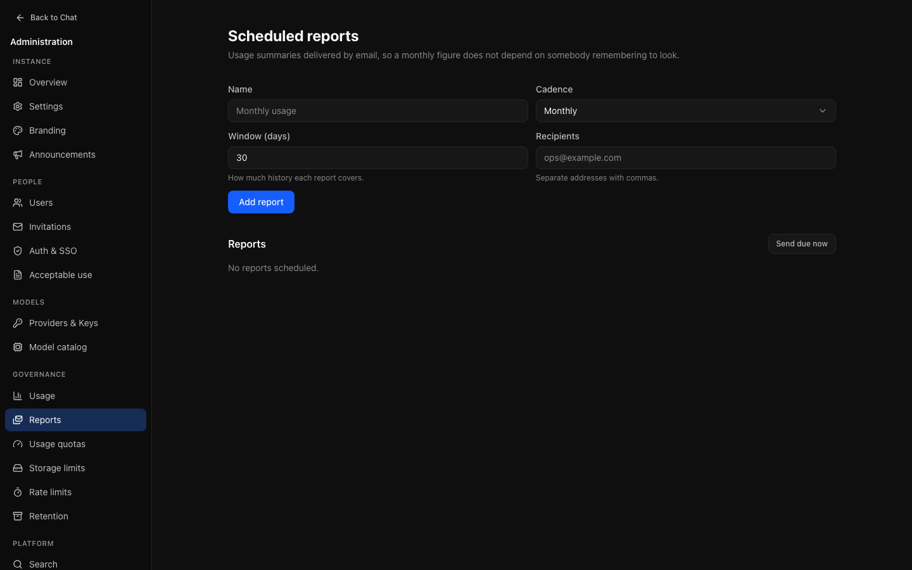

# Audit and reporting

## The audit log

Who did what, when, and from where.

### What is recorded

**Administrative action** — settings, models, providers, quotas, invitations,
policies, announcements, bulk operations.

**Authentication** — sign-in, sign-up, sign-out, password reset, email change,
verification, and single sign-on. Including **failures**, and including for an
account that does not exist, which is what makes a brute-force attempt visible.

Only outcomes are recorded. No credentials, no tokens, no request bodies.

### Searching it

Search, action family, and date window are applied **in the query**, across
retained history rather than the page in front of you. Typing `auth.` in the
action filter finds every authentication event without naming each one.

Searching an IP address finds everything that came from it, which is usually
where an investigation starts.

### Export

**Export** produces CSV of everything matching the current filters, up to fifty
thousand rows. Filter first — exporting everything and sorting it afterwards is
slower than asking a narrower question.

### Configuration changes

A settings entry records what a value **was** as well as what it became, so
"who disabled sign-on last Tuesday, and what was it before" has an answer.

Secret values record only whether they are set, cleared, or replaced. The value
never enters the log.

## Usage

What has been consumed: totals, daily volume, a breakdown by model, and the
heaviest consumers.

Use it before setting a quota. A limit chosen from observed use lands better
than one chosen from an assumption, and this page is how you find out what
ordinary use looks like on your instance.

## Scheduled reports

A usage summary delivered by email, daily, weekly, or monthly.

Somebody who wants a monthly figure will not remember to open a page for it,
which is the entire reason these exist. Send the monthly summary to whoever asks
about spend and the questions stop.

Points worth knowing:

- **Due-ness is decided from the last send**, not a calendar expression. A
  replica that was down over a boundary sends once when it returns rather than
  skipping the period.
- **Send due now** exists so you can check the recipients and the content
  without waiting a month to discover the address was wrong.
- **A failure is recorded on the report**, not only in the logs, so you can see a
  report has been failing without reading server output.
- Reports need email configured. Without SMTP they are quietly skipped, and
  [Health](operations.md#health) will be saying so.
