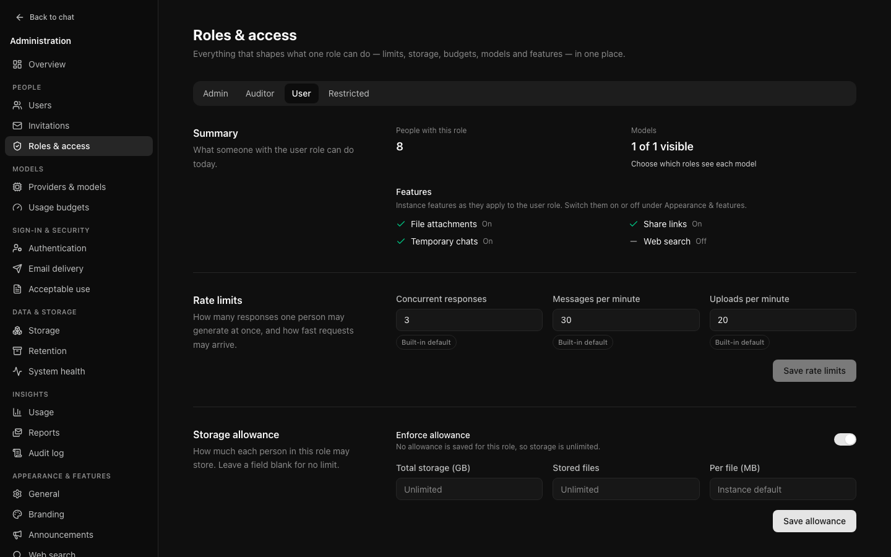
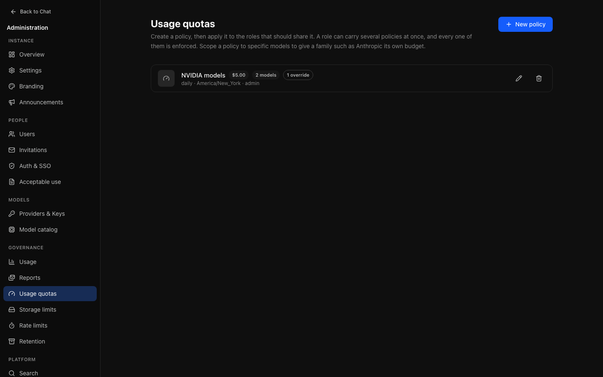
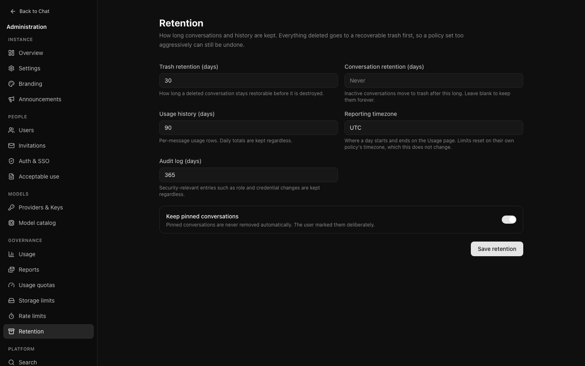
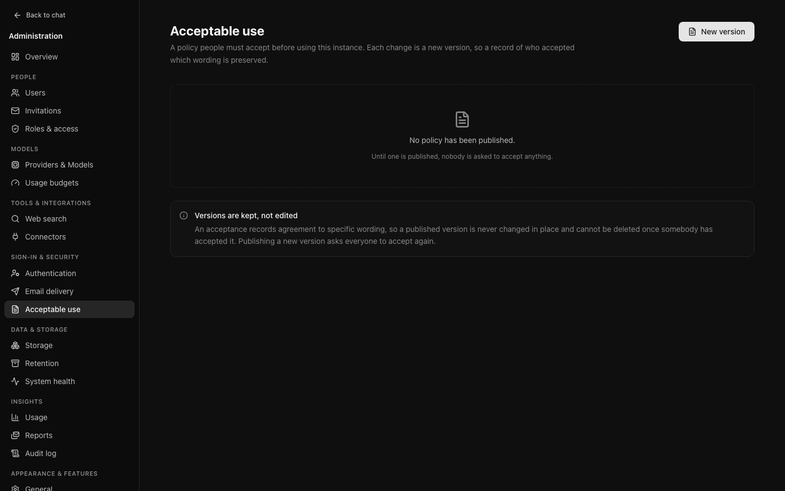

# Governance

Who may consume what, how much, and for how long it is kept.

## Roles and access

**People → Roles & access** (`/admin/roles`) gathers everything that shapes
one role on one page, with a tab per role. The values come from the same code
that enforces them, so the page cannot disagree with what somebody in that role
experiences.

For each role:

- **People with this role** — a count that opens the user list filtered to
  that role.
- **Models** — how many of the available models (enabled, on an enabled
  provider) the role can see. Visibility is set per model on
  [Providers & Models](models-providers.md). People in a role that sees none
  are told on the chat page that no models are available to their role and
  to ask an administrator.
- **Features** — editable switches for web search, file attachments, share
  links, temporary chats, branching, projects, artifacts and deleting one's
  own account, plus the reasoning levels the role may choose. See [Features and reasoning levels](#features-and-reasoning-levels).
- **Fixed rules** — what is always true for the role and no setting changes:
  administrators have full access; auditors can view administration but not
  change it.
- **Rate limits** and **Storage allowance** — editable here; see below.
- **Usage budgets** — the budgets assigned to the role, read-only, with a link
  to [Usage budgets](#usage-budgets) to change them.

Below the role tabs, **Instance-wide** holds the limits that apply to everybody
regardless of role: sign-in attempts per minute (counted per IP address and per
account; see [below](#sign-in-attempts)), and the cost and tokens reserved
while a response generates.

### Features and reasoning levels

Each role has its own switches for **web search**, **file attachments**,
**share links**, **temporary chats**, **branching** (forking a conversation
or editing an earlier message into a new branch), **projects**, **user
memory**, **artifacts** and **delete own account** (see
[Self-service account deletion](#self-service-account-deletion)). A role switch
can only narrow what the instance offers. Somebody can use a feature when both
of these are on:

- the instance-wide switch, under **Appearance & features → General** (or, for
  web search, the [Web search](operations.md#web-search) page, which also needs
  a working provider);
- the switch for their role, here.

When the role's switch is on but the instance's is off, the page says so under
the switch. The server enforces both; hiding a control in the interface is a
convenience, not the boundary. A request for a feature the role does not allow
is refused with `403` and a message such as "Attachments are not available for
your role"; a feature switched off instance-wide is refused as before.

**Reasoning levels** choose which effort levels (Low, Medium, High) the role
may pick on models that offer effort control. Instant is always allowed. The
model picker offers, and the server accepts, only levels that both the model
and the role allow; a model whose only levels are withheld from the role is
shown without effort control.

Out of the box the switches reproduce the rules that were fixed before they
were configurable: the `restricted` role cannot upload attachments, create
share links or start temporary chats, and every other role can use everything
the instance offers, at every reasoning level. Projects, user memory and
artifacts, added later, follow the same line and are off for `restricted`
until you turn them on; user memory is also off instance-wide by default.
Saving sends only
the fields you changed, and each save is recorded in the audit log as
`role.features.update` with the previous and new values. Auditors see the
switches but cannot change them. API: `PUT /api/admin/roles/:role` with any of
`webSearch`, `attachments`, `shareLinks`, `temporaryChat`, `branching`,
`projects`, `memory`, `artifacts`, `accountDeletion` (booleans) and
`reasoningEfforts` (a list that must include `instant`).

Turning **share links** off for a role (or instance-wide) stops new links;
people keep seeing the links they made under Settings → Sharing and can still
revoke them there or from the conversation. Revoking is recorded as
`share_link.revoke` (one link) or `share_link.revoke_all` (with the count).

### Self-service account deletion

**Delete own account** (v0.10) lets people in the role delete their own
account under Settings → Account. It is **off for every role** by default and
has no instance-wide switch.

It is a role switch rather than one instance-wide setting because the
decision usually differs by population: an institution may let students and
guests leave on their own while keeping staff and administrator accounts,
whose data has records obligations, behind an administrator. It sits beside
the other per-role switches so Roles & access stays the one place that says
what a role may do.

The person types their email address and, if the account has a password,
enters it. The deletion is the same as **Delete user** under People (see
[Deleting an account](people.md#deleting-an-account)): the same cascade, and
the same refusals for a person on [legal hold](compliance.md#legal-hold) (the
person is told only that deletion is paused by the organisation) and for the
last administrator. It is also refused in a session an administrator opened
as the person; delete under People instead, where the entry names you. It is
recorded as a `user.delete` entry with
`metadata.self: true` and `metadata.deletion.reason: "user"`; a wrong password
is recorded as `user.delete.failure`. Better Auth's own admin endpoints
(`/api/auth/admin/*`: roles, bans, account edits, passwords, impersonation and
deletion) are disabled: they would make these changes without an audit entry,
a webhook or these checks. Every account change goes through People → Users,
and administrators cannot open a session as another person.

For an account that signs in through single sign-on there is no password to
ask for; signing in again later creates a new, empty account (through
just-in-time provisioning), which the confirmation explains. If that is not
wanted, leave the switch off for roles whose people sign in that way, or limit
who may sign in under [Identity](identity.md).

### Projects

[Projects](../user/projects.md) let a person group conversations under shared
instructions (up to 8,000 characters) and files (up to 20 per project; 100
projects per person). There is no instance-wide switch: the role's **Projects**
switch alone decides. Governance follows the features projects reuse:

- **Files** are attachments. Uploading needs file attachments to be allowed
  for the role and the instance, uses the upload rate limit, and counts against
  the [storage allowance](#storage-allowance). Removing a file, or deleting its
  project, deletes it at once (not to the trash) and frees its allowance; the
  stored object is removed by the usual storage reaper. Project files are never
  reported as stale uploads or treated as orphans by storage reconciliation.
- **Context**: project instructions are appended to the system prompt after the
  instance prompt and the person's personalisation, delimited and marked as
  subordinate to them. File text is budgeted like any attachment and left out
  when it does not fit the model's context.
- **Switching projects off for a role** keeps existing projects and their files
  (still counted against storage) but refuses every project request with `403`
  ("Projects are not available for your role"), and stops their instructions
  and files being added to conversations, which carry on as ordinary ones.
  Without file attachments, instructions still apply but files are not used.
- **Retention** applies to conversations, not projects: an inactive
  conversation in a project is trashed as usual, and the project stays.
  Deleting a project detaches its conversations; it never deletes them.
- **Audit**: like conversations and share links, creating, changing and
  deleting projects is personal content and is not written to the audit log.
- **Export** includes each project's name, instructions and files.
- Deleting an account deletes its projects and their files.

The level a new conversation starts at is set instance-wide as **Default
reasoning level** on [General settings](instance-settings.md). When the chosen
model or the person's role does not allow it, the composer starts at Instant.

### User memory

[Memory](../user/memory.md) is a list of short notes about a person (at most
200, each up to 500 characters) that OCI adds to their system prompt. It takes
three switches, all off for a new instance: **User memory** under
**Appearance & features → General** (instance-wide, off by default), the
role's **User memory** switch here (on for every role except `restricted`, but
only effective while the instance switch is on), and each person's own **Use
memory** in Settings → Memory (off by default). Notes are read and the tools
offered only when all three are on, and never in temporary chats.

- **How notes are made.** People write them in Settings → Memory. With a
  `tool_calling` model, the built-in `remember` and `forget` tools let the
  model save and remove notes. They are not listed under the role's tools
  below: the role's **User memory** switch governs them. They need no
  approval, although they write data, because they change only the person's
  own notes inside OCI, the person opted in, and every change is shown in the
  reply with an **Undo** and listed in Settings.
- **Context.** Notes are appended to the system prompt after the instance
  prompt, the person's personalisation and any project instructions, newest
  first, in a delimited section that presents them as notes about the person,
  not instructions. They take at most 5% of the model's input budget and never
  more than 8 KiB; older notes that do not fit are left out. A compaction
  summary follows them and is budgeted after them.
- **Switching it off** (instance or role) stops notes being read or written
  at once. People keep their notes and can still list, delete and export them;
  adding and editing are refused with `403`.
- **Retention.** **Memory retention** on [Retention](#retention) deletes notes
  not updated for that many days. Off by default.
- **Audit.** `memory.add`, `memory.update` and `memory.delete` record counts,
  the source (`tool` or `person`), how the change was made (`tool`,
  `settings`, `undo` or `retention`) and ids, never the text.
  `memory.settings.update` records a person switching memory on or off.
  Since v0.10 every deleted note has its own `memory.delete`, a
  [deletion event](compliance.md#deletion-events), including those removed by
  retention (no actor) or by deleting all notes.
- **Legal hold.** A person on [legal hold](compliance.md#legal-hold) cannot
  delete notes (in Settings, with `forget` or by undoing a saved note), and
  retention skips their notes.
- **Export.** A person's full export includes their notes as `memory.json`.
  Deleting an account deletes its notes.

### Artifacts

[Artifacts](../user/artifacts.md) (v0.9) keep HTML pages, SVG images, Mermaid
diagrams and documents from replies as versioned objects. There is no
instance-wide switch: the role's **Artifacts** switch alone decides (on for
every role except `restricted`).

- **What it controls.** With the switch on, finished replies' HTML, SVG and
  Mermaid blocks are saved as artifacts; tool-capable models are offered
  `create_artifact` and `update_artifact`; the system prompt gains a short
  section on how to make them; and people can edit Markdown documents. With it
  off, none of these happen and an edit is refused with `403` ("Artifacts are
  not available for your role"); the system prompt instead tells the model
  that it cannot create documents or files, so it writes the content in its
  reply rather than claiming to have made one; existing artifacts stay
  readable by their owner.
- **Artifact tools** change only OCI's own data in the current conversation,
  so they need no approval and are not listed under the role's tools. Each call
  is still a `tool.call` audit event (kind `read`).
- **Sandbox.** HTML and SVG run in a frame with `sandbox="allow-scripts"` and
  no `allow-same-origin`, under a Content-Security-Policy that allows no
  network access, served from `/artifact-frame.html`. Share links use the same
  frame. A reverse proxy in front of OCI must serve that one path with its own
  policy and allow it to be framed by OCI itself (see
  [Operations](../OPERATIONS.md#artifacts-migration-0032)).
- **Limits.** A version is at most 512 KB, an artifact has at most 100
  versions and a conversation at most 200 artifacts.
- **Storage, retention, export.** Every version counts towards the owner's
  [storage allowance](#storage-allowance) while the conversation is not in the
  trash. Artifacts are deleted with their conversation (trash purge,
  retention, temporary chats, account deletion), included with all versions in
  the JSON export, and shared through the conversation's share link at the
  shared version, with credentials redacted like message text.
- **Diagram guidance.** **Editorial diagrams** on
  [General settings](instance-settings.md#general) (on by default) asks models
  to draw diagrams as SVG artifacts following the
  [Diagram Design](https://github.com/cathrynlavery/diagram-design) style guide
  (MIT, Cathryn Lavery), using the instance's accent colour. Turn it off to
  keep only the general artifact guidance. API: `PATCH /api/admin/settings`
  with `{ "diagramGuidance": false }`.

### Tools

Models with the `tool_calling` capability can call **tools** during a reply
(see [Tools](../user/tools.md) for what people see). The **Tools** section of
a role lists every tool OCI can offer with a switch per role. A tool is
offered to a model only when all of these hold:

- the model's catalogue entry has the `tool_calling` capability (edit it on
  [Providers & Models](models-providers.md));
- the role's switch for the tool is on;
- the tool is switched on for the instance, and for the message where the
  composer has a switch. Web search (`web_search`) needs the instance's web
  search to be on and configured, the role's **Web search** feature, and the
  person's **Search** switch for that message. A connector tool
  (`mcp__<connector>__<tool>`) needs its connector and the tool enabled on
  [Connectors](connectors.md) and, for a connector where each person signs
  in, the person's own connection.

Each tool is `read` (looks something up; runs without asking) or `write`
(changes something elsewhere; the person approves every call). The switches
are stored sparsely, so a tool added later inherits a default: built-in read
tools are on for every role except `restricted`; write and connector tools are
off until you allow them. Connector tools appear in this section once enabled
on [Connectors](connectors.md), grouped under their connector's name, and
their allows are removed when the connector is deleted. Saving sends only the tools you changed and is
recorded as `role.tools.update` with the previous and new values. Auditors see
the switches but cannot change them. API: `PUT /api/admin/roles/:role/tools`
with `{ "tools": { "web_search": true } }`.

With a tool-calling model and Search on, the model searches when it chooses,
possibly several times, instead of OCI running one search before the reply.
Models without tool calling, and roles whose `web_search` switch is off, keep
the single search before the reply.

Every tool call writes a `tool.call` audit event: the tool id, its kind,
whether it needed approval and the answer (`approved`, `denied`,
`not answered`), the outcome (`ok`, `error`, `denied`, `refused`), duration
and result size. Inputs and results are never written to the audit log; they
live in the conversation and follow its retention, including for temporary
chats. A call to a tool outside the reply's tool set is refused and recorded as
`refused`.

A reply's steps are limited by **Tool step limit** on
[General settings](instance-settings.md#general). Each step after the first
checks the person's remaining [usage budget](#usage-budgets) and ends the reply
if it is spent; usage is settled for the whole reply, across all its steps.

### Where a value comes from

Each rate limit and instance-wide value carries a label:

- **Saved** — set on this page. This wins over everything else.
- **From environment** — set by an environment variable such as
  `RATE_LIMIT_CHAT_PER_MINUTE`, and used because nothing is saved.
- **Built-in default** — neither is set.

Saving a field here overrides the environment for that field only; fields you
did not change keep inheriting. [Retention](#retention) values carry the same
labels.

## Usage budgets

**Models → Usage budgets** (`/admin/quotas`). A budget — a quota policy —
caps consumption, and is applied to one or more roles. A role can carry several
at once and every one is enforced; each person gets the full amount on their
own. Its name is for administrators: people see what a budget counts and its
period ("You have reached your message limit for today"), never its name.
Three things to decide.

### What to measure

| Metric | Suits |
| --- | --- |
| **Messages** | Simplest to explain. "500 messages a month" is understood without translation. |
| **Tokens** | Closer to real cost, since a long conversation costs more than a short one. Harder to explain to somebody who hits it. |
| **Cost** | Exact, and the only one that means anything across models of different prices. |

Measure cost when models differ in price, messages when they do not. Tokens are
mostly a worse version of one or the other.

### Which window

- **Rolling** — the last 24 hours or 7 days, moving continuously. Capacity
  returns gradually as usage ages out. Smoother, and harder to game.
- **Calendar** — resets on a boundary. Easier to explain, and produces a rush at
  the start of each period.

Either way the count is exact to the moment, in the budget's own time zone,
and includes what replies in progress have reserved. From v0.11 it is read
from hourly usage totals, so checking a budget before each message costs the
same for someone who sends thousands a month as for someone who sends a few
(see [How the figures are read](audit-reporting.md#how-the-figures-are-read)).

### Which models

A quota can apply to everything or to specific models. Scoping is what lets you
be generous with an inexpensive model and strict with an expensive one, which is
usually what you actually want.

### A worked example

A department wants staff using a costly model without an open-ended bill.

- Metric: **cost**
- Window: **calendar month**
- Scope: **the expensive model only**
- Limit: enough for ordinary use; look at [Usage](audit-reporting.md#usage) for a
  fortnight first rather than guessing

People are warned as they approach the limit — at eighty per cent, and again at
ninety-five. The thresholds are fixed, not set per budget. The warning matters:
somebody who hits a wall with no notice files a ticket; somebody warned at
eighty per cent adjusts.

### Overrides

An individual can be granted more without changing the policy, from **Limits**
beside their name in [the user list](people.md) or **Adjust limits** on their
account page. Set an expiry where the need is temporary.

## Storage allowance

How much each person in a role may hold in attachments: total storage, number of
stored files, and the largest single file. A blank total or file count means no
limit; a blank per-file size falls back to the instance upload limit on
[Storage](operations.md#storage). Any value you enter must be greater than 0
(the file count a whole number), at most 1,024 GB in total and 1,024 MB per
file; 0 is refused rather than read as "no limit". To stop a role storing files
at all, turn off its attachments feature instead. **Enforce allowance** switches the allowance off without losing the values. A
role with nothing saved is unlimited and shows the switch off; entering a limit
turns it on, and **Save allowance** is available once something has changed. Set on **People → Roles & access**.

Artifact versions count towards total storage (not towards the file count)
while their conversation is not in the trash.

Storage is a **gauge, not a flow**: it measures what somebody holds now, not
what they have ever uploaded. In-progress uploads reserve space. Deleting files
or moving their conversation to trash frees allowance immediately, even while
the objects remain recoverable. Restoring a conversation requires enough free
allowance for its files.

## Rate limits

Concurrent responses, messages per minute, and uploads per minute, per role,
also on **Roles & access**. Each value shows
[where it comes from](#where-a-value-comes-from).

These are not a budget — that is what usage budgets are for. They stop one client
overwhelming the instance, and a person working normally should never meet one.

**Starting conversations** (v0.10.2) is limited by the same messages-per-minute
value, counted separately: every new conversation is followed by its first
message, so a person can start as many conversations a minute as they can send
messages. On top of that, a person who already has ten conversations from the
last minute that are still untitled and empty is refused another until one is
used or a minute passes. Both answer 429 with `Retry-After`. Together they stop
a looping client, such as a misbehaving browser automation, from filling an
account with empty "New Chat" conversations. Conversations that were started
and never used are deleted after a day (see
[compliance](compliance.md)).

The concurrency cap does double duty: it bounds how far a quota can be overshot
by simultaneous requests, since each reserves budget before anybody knows what
it will cost. These are estimates, not a guarantee that a provider bill cannot
exceed the configured budget. Use provider-side spending controls where a hard
financial cap is required.

A complete usage report replaces the estimate. If a provider omits usage, the
remaining estimate stays held within the policy window rather than treating the
request as free. It is released when complete usage arrives, a never-started
attempt is safely cancelled, or the request ages out of that policy window.
The fifteen-minute recovery sweep marks abandoned usage as unknown; it does not
forgive uncertain spend or take over active generations.

The amounts held while a response generates are the **Budget held per
response** and **Tokens held per response** values under **Instance-wide**.

### Sign-in attempts

**Sign-in attempts per minute** (`RATE_LIMIT_AUTH_PER_MINUTE`, default 10)
limits how fast one account's credentials can be tried. It counts:

- **failed sign-ins per account**, the email address in the request, from any
  address, so many machines cannot try one account. A successful sign-in is
  not counted;
- every sign-up, password reset and verification request naming the account;
- password and email changes per signed-in session.

A client address has its own, much larger allowance, set by your operator:
300 **failed** attempts a minute by default (`RATE_LIMIT_AUTH_ADDRESS_PER_MINUTE`),
and ten times that for every request. Many people behind one address, such
as a campus network, can therefore all sign in at once. Single sign-on is
budgeted per identity provider instead
([Sign-in limits](../OPERATIONS.md#sign-in-limits)).

Past a limit the request is refused with `429 Too Many Requests` and a
`Retry-After` header until the minute ends; the sign-in page shows *Too many
attempts. Wait a minute and try again.* The first refusal in each minute for
an address, account or provider is audited as `auth.rate_limited` (the
address, the account tried, the endpoint and which limit refused), so a flood
of refused requests does not flood the audit log too. Refused requests never
reach the sign-in code, so they are not also recorded as failed sign-ins.

The counters live in Redis, so every API replica shares them; without Redis
each replica counts on its own (as for the other limits). Signing out and
reading the session are not counted. Better Auth's own built-in limiter is
off from v0.11; these are the only limits.

## Retention

**Data & storage → Retention.** How long conversations, usage history, and audit
entries are kept. Each field shows
[where its value comes from](#where-a-value-comes-from).

- **Conversation retention** — inactive conversations move to the trash after
  this long; blank keeps them forever. Nobody thanks you for a short period they
  were not told about; state it in your acceptable use policy. Shared
  conversations are not exempt. **Keep pinned conversations** exempts anything a
  person has pinned.
- **Trash retention** — the recovery window before a deletion becomes permanent.
- **Usage history** — per-message usage rows. Daily totals are kept regardless.
- **Reporting timezone** — where a day starts and ends on the Usage page, and
  the zone of today's date in a system prompt when the person's browser does
  not give its own. Budgets reset on their own timezone, which this does not
  change.
- **Memory retention** — [user memory](#user-memory) notes not updated for
  this long are deleted by a daily job; blank (the default) keeps them until
  the person deletes them.
- **Audit log** — how long the record of administrative action survives.
  Check what your institution requires before shortening this. Access-control
  and security changes are kept regardless: account creation, edits and
  deletion, role changes (including bulk role, ban and unban), provider and
  single sign-on changes, sign-in policy changes, webhook endpoint changes,
  backup and compliance export settings changes, and legal holds.

People on [legal hold](compliance.md#legal-hold) are skipped by conversation,
trash, audit and memory retention until the hold is lifted.

Retention is easier to introduce early and shorten later than to impose on an
instance where people have accumulated two years of work.

## Acceptable use

**Sign-in & security → Acceptable use.** A policy people must accept before
using the instance.

### Versioned, never edited

Publishing a change creates a new version. An acceptance records agreement to
specific words, so rewriting the text under an existing acceptance would make
the record untrue.

Consequences:

- **Publishing a new version re-prompts everybody**, automatically. Nobody has
  accepted a version that did not exist when they last signed in.
- **Somebody re-prompted is told the policy changed**, rather than being shown it
  as though it were new.
- **A published version cannot be changed or deleted**, even before anybody
  has accepted it: people may be accepting it at that moment. The database
  also refuses to delete a version somebody accepted, because that would
  destroy the record of what they agreed to. Only a [draft](#drafts) can be
  reworded or deleted.

### Drafts

Turn off **Publish immediately** to save a draft. Nobody is asked to accept a
draft, so it can still be reworded (**Edit**) or discarded (**Delete**) until
you **Publish** it, which asks for confirmation first. Once published, the
wording is fixed. **View** shows the full text of any version, drafts and
published ones alike, to administrators and auditors.

Each edit of a draft is audited as `policy.update`, with the title as it was
and became and `textChanged`. A changed text is recorded by its length and
SHA-256 digest before and after, never by its wording, which can be long. A
save that changes nothing is not recorded.

### What is recorded

The version, the moment, and the address it came from. Enough to answer "what
exactly did this person agree to, and when" later.

### Practical advice

Publish before opening the instance. A policy published afterwards prompts
everybody at once, which looks like an incident to people who have been working
happily for months.
