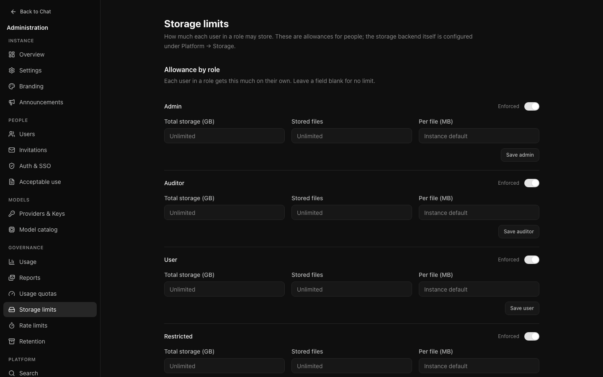
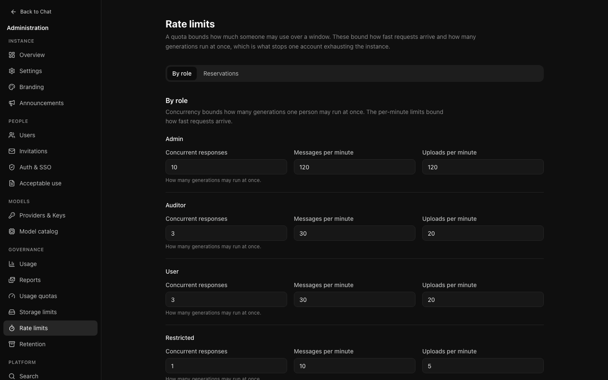

# Governance

Who may consume what, how much, and for how long it is kept.

## Usage quotas

A quota caps consumption per role. Three things to decide.

### What to measure

| Metric | Suits |
| --- | --- |
| **Messages** | Simplest to explain. "500 messages a month" is understood without translation. |
| **Tokens** | Closer to real cost, since a long conversation costs more than a short one. Harder to explain to somebody who hits it. |
| **Cost** | Exact, and the only one that means anything across models of different prices. |

Measure cost when models differ in price, messages when they do not. Tokens are
mostly a worse version of one or the other.

### Which window

- **Rolling** — the last 24 hours or 7 days, moving continuously. Capacity
  returns gradually as usage ages out. Smoother, and harder to game.
- **Calendar** — resets on a boundary. Easier to explain, and produces a rush at
  the start of each period.

### Which models

A quota can apply to everything or to specific models. Scoping is what lets you
be generous with an inexpensive model and strict with an expensive one, which is
usually what you actually want.

### A worked example

A department wants staff using a costly model without an open-ended bill.

- Metric: **cost**
- Window: **calendar month**
- Scope: **the expensive model only**
- Limit: enough for ordinary use; look at [Usage](audit-reporting.md#usage) for a
  fortnight first rather than guessing
- Warn at: **80%**

The warning matters. Somebody who hits a wall with no notice files a ticket;
somebody warned at eighty per cent adjusts.

### Overrides

An individual can be granted more without changing the policy, from **Limits**
beside their name in [the user list](people.md). Set an expiry where the need is
temporary.

## Storage limits

How much each role may hold in attachments.

Storage is a **gauge, not a flow**: it measures what somebody holds now, not
what they have ever uploaded. In-progress uploads reserve space. Deleting files
or moving their conversation to trash frees allowance immediately, even while
the objects remain recoverable. Restoring a conversation requires enough free
allowance for its files.

## Rate limits

Requests per minute and how many replies may stream at once, per role.

These are not a budget — that is what quotas are for. They stop one client
overwhelming the instance, and a person working normally should never meet one.

The concurrency cap does double duty: it bounds how far a quota can be overshot
by simultaneous requests, since each reserves budget before anybody knows what
it will cost. These are estimates, not a guarantee that a provider bill cannot
exceed the configured budget. Use provider-side spending controls where a hard
financial cap is required.

A complete usage report replaces the estimate. If a provider omits usage, the
remaining estimate stays held within the policy window rather than treating the
request as free. It is released when complete usage arrives, a never-started
attempt is safely cancelled, or the request ages out of that policy window.
The fifteen-minute recovery sweep marks abandoned usage as unknown; it does not
forgive uncertain spend or take over active generations.
## Retention

How long conversations, audit entries, and deleted items are kept.

- **Conversations** — after this, they are removed. Nobody thanks you for a
  short period they were not told about; state it in your acceptable use policy.
- **Deleted items** — the recovery window before a deletion becomes permanent.
- **Audit entries** — how long the record of administrative action survives.
  Check what your institution requires before shortening this.

Retention is easier to introduce early and shorten later than to impose on an
instance where people have accumulated two years of work.

## Acceptable use

A policy people must accept before using the instance.

### Versioned, never edited

Publishing a change creates a new version. An acceptance records agreement to
specific words, so rewriting the text under an existing acceptance would make
the record untrue.

Consequences:

- **Publishing a new version re-prompts everybody**, automatically. Nobody has
  accepted a version that did not exist when they last signed in.
- **Somebody re-prompted is told the policy changed**, rather than being shown it
  as though it were new.
- **A version somebody accepted cannot be deleted.** The database refuses,
  because deleting it would destroy the record of what they agreed to.

### What is recorded

The version, the moment, and the address it came from. Enough to answer "what
exactly did this person agree to, and when" later.

### Practical advice

Publish before opening the instance. A policy published afterwards prompts
everybody at once, which looks like an incident to people who have been working
happily for months.
