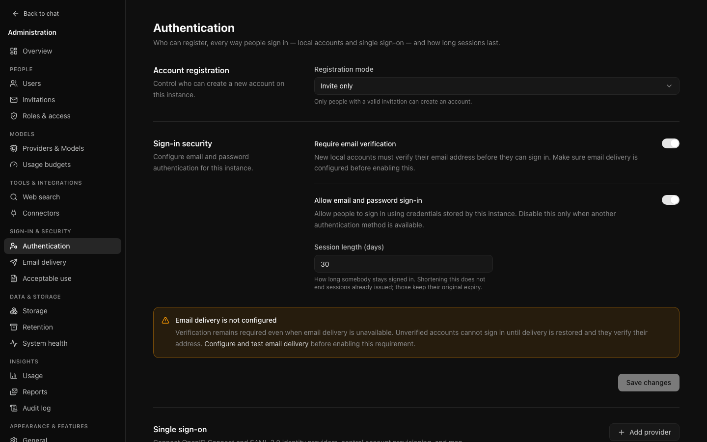
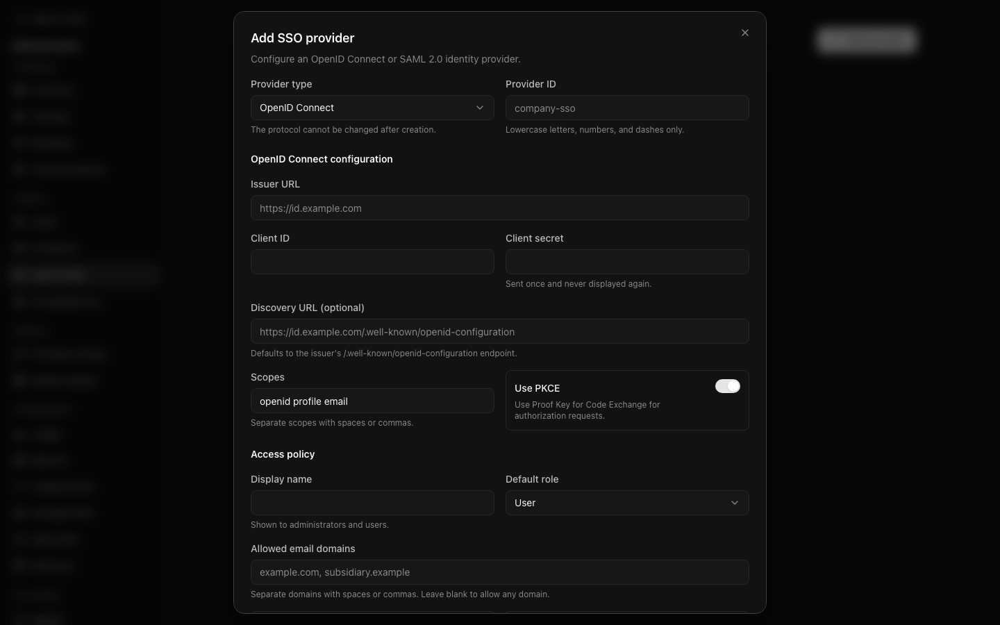

# Identity and access



Every way of signing in is configured on one page, **Sign-in & security →
Authentication** (`/admin/settings/authentication`): registration, local email
and password sign-in, session length, and — further down, under **Single
sign-on** — OIDC and SAML providers. The old `/admin/sso` address lands on that
section.

## Roles

| Role | Can |
| --- | --- |
| `admin` | Everything, including changing any setting |
| `auditor` | Read every administrative page, change nothing |
| `user` | Use the instance normally |
| `restricted` | Use it with tighter limits and, by default, fewer features |

`auditor` exists so a compliance reviewer does not need write access to do their
job. It is enforced on the request method, not on a list of pages, so a new
administrative page is read-only for an auditor the moment it exists rather than
when somebody remembers to add it. In the dashboard an auditor sees a read-only
banner on every page, and buttons that would save something are hidden or
disabled.

What each role is held to — rate limits, storage allowance, usage budgets,
visible models, and the features it gets — is shown together on **People →
Roles & access**. See [governance](governance.md#roles-and-access).

## Local accounts

**Authentication** controls whether email and password sign-in is available at
all, whether addresses must be verified, and how long a session lasts. If
neither local sign-in nor an enabled single sign-on provider is available, the
page and the [setup checklist](first-run.md#4-offer-a-way-to-sign-in) say that
nobody can sign in.

Sign-in, sign-up, password reset and verification are limited to
**Sign-in attempts per minute** per client address and per account (default
10); past it the request is refused with `429` for the rest of the minute. See
[sign-in attempts](governance.md#sign-in-attempts).

Turning local authentication off still admits a **verified administrator**,
deliberately, so the setting cannot lock everybody out. That safety net depends
on at least one administrator having a verified address and a password somebody
knows — check that before turning it off.

The same rule covers changing a password in Settings → Account: while local
authentication is off, only a verified administrator can change their password
there, and the server refuses anyone else. People cannot change their own email
address or delete their own account; Settings tells them to ask you (see
[People](people.md)).

### Required email verification

When required, local signup does not issue a session until the address is
verified. Missing SMTP, rejected delivery, and unavailable authentication
settings do not waive the requirement. Invitations and administrator-created
accounts also remain unverified when delivery fails.

Configure and test SMTP before enabling this setting. After delivery recovers,
users can **Resend verification email** from the signup or invitation confirmation,
or after an unverified sign-in is refused. They do not need a new account or
invitation. A resend confirmation is not proof that a message reached the inbox.

Already-verified administrators retain the local recovery path when settings
cannot be read. If needed, use the operator-only
[recovery CLI](../OPERATIONS.md#getting-back-in-when-sign-on-fails); an unverified
administrator does not receive an automatic exemption.

Explicitly disabling verification still permits local accounts without email
proof and marks newly created accounts verified. Enabling it later does not
retroactively revoke those accounts or existing sessions. Review accounts created
under older versions during delivery failures: historical `emailVerified` flags
do not distinguish actual email proof from the previous delivery-failure fallback.
Audit verification “success” events are not sufficient proof either: some token
errors redirect and are recorded as successful HTTP outcomes. Do not bulk change
flags or sessions based on dates or absent logs. See the
[historical evidence assessment](../dev/email-verification-provenance.md) before
planning account re-verification.

### Session length

**Session length (days)** is how long somebody stays signed in, between 1 and
365 days.

Shortening it does not end sessions already issued; those keep the expiry they
were given. If you need people out now, use **Sign out everywhere** on their
[account page](people.md#looking-at-one-person), or select several accounts in
the user list and sign them out together.

## Adding an identity provider



OIDC and SAML are both supported. The form asks for what the protocol needs;
what follows are the fields whose consequences are not obvious.

### Allowed email domains

Blank accepts any domain the provider asserts. Set this when the provider serves
more people than should reach your instance.

### Trust for account linking

Off by default. When on, a sign-in attaches to an existing local account with
the same address.

Only enable this for a provider that genuinely verifies email ownership. One
that does not could be used to take over an account by asserting somebody else's
address.

### Group and claim mappings

A mapping says: when this claim carries this value, grant this role.

```
Claim: groups          Value: oci-staff        Role: user
Claim: groups          Value: oci-admins       Role: admin
Claim: attributes.dept Value: contractors      Role: restricted
```

Points worth knowing:

- **Group membership usually arrives as a list**, and a rule matches if any
  entry does.
- **A dotted path reaches a nested claim**, which SAML and some OIDC providers
  need.
- **Matching ignores case**, because directories are inconsistent about it.
- **Where several rules match, the most privileged wins.** Row order is an
  authoring detail, not a privilege decision.

### Require a matching role

**This is the setting that makes group mapping an authorisation boundary.**

Off, somebody who matches no rule receives the default role — so everybody the
provider will authenticate gets an account. At an institutional provider that is
the entire institution.

On, they are refused and shown the message you write. Something like "Request
access through the IT service desk" is more useful than the generic wording,
because it tells them what to do next.

It is off by default so that upgrading cannot start refusing logins that
previously worked. Turning it on is a deliberate act.

### Skip the sign-in form

Sends visitors straight to the provider. Convenient, and it removes the local
form from view.

`/auth/login?local=1` always shows the form regardless. **Confirm that works
before you enable this**, because it is the only route back in if the provider
fails.

## How roles behave after the first sign-in

A role is recalculated from the provider's claims **on every sign-in**, not just
the first. Two consequences catch people out:

- **A role set by hand does not persist.** Promote somebody in the user list and
  their next sign-in returns them to whatever the mapping says. To grant a
  lasting role, change their group membership at the provider or add a mapping
  for a group they are already in.
- **A role can fall as well as rise.** Somebody removed from a mapped group
  drops to whatever still matches, or to the default.

## Verifying it works

Do this before turning off local authentication, not after:

1. Add the provider with **Require a matching role** off.
2. Sign in as a real person from a real group.
3. Check [the audit log](audit-reporting.md) for `auth.signin.sso.success` and
   confirm the role they received.
4. Add the mappings, then sign in again and confirm the role changes as you
   expect.
5. Turn **Require a matching role** on, and test with an account in no mapped
   group. It should be refused with your message.
6. Only then consider disabling local authentication.
