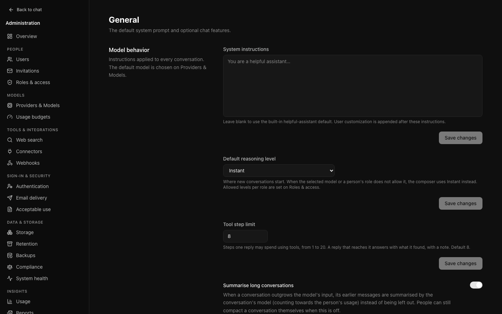
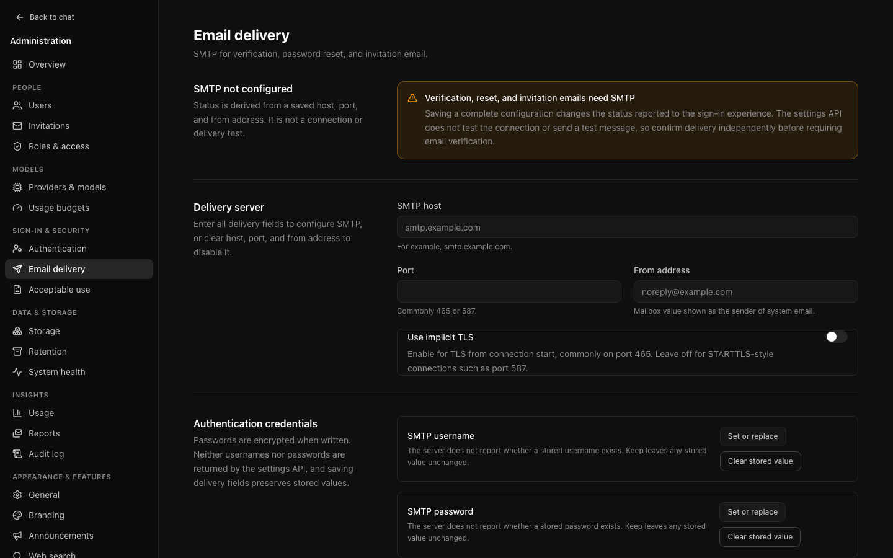
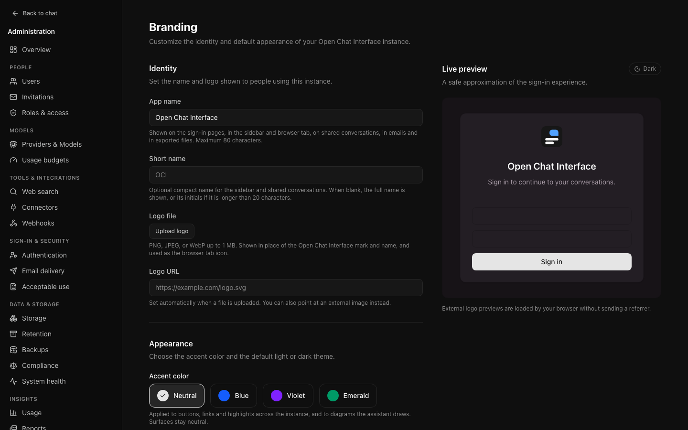
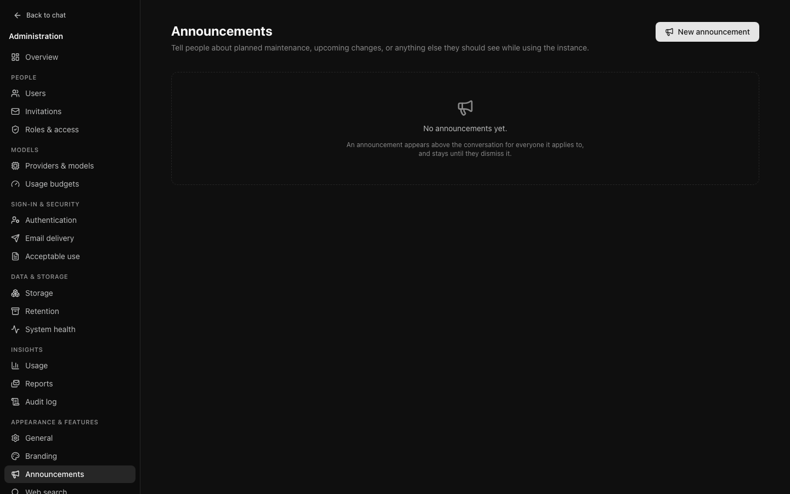

# Instance settings

The settings that once shared a tabbed page are now separate pages, each with
its own address: **General** and **Branding** under **Appearance & features**,
**Authentication** and **Email delivery** under **Sign-in & security**.

## General

**Appearance & features → General**, at `/admin/settings/general`.

**Default system prompt** is sent with every conversation on the instance.
Leave it blank to use the built-in default; a person's own customisation is
appended after it. Keep it short. A long prompt is charged on every message and
is the first thing to suspect when replies drift from what people expect.

**Default reasoning level** is where the effort control starts in a new
conversation: Instant, Low, Medium or High. People can still change it per
message. When the selected model, or the levels allowed for the person's role
on [Roles & access](governance.md#features-and-reasoning-levels), do not
include it, the composer starts at Instant instead.

**Tool step limit** is how many steps one reply may spend using
[tools](governance.md#tools): 1 to 20, default 8. Each search or other tool
call usually costs a step. A reply that reaches the limit gets one more step
with the tools withdrawn, so it still answers with what it found, and a note
says the limit was reached. A higher limit lets a model research more thoroughly at the
cost of more usage per reply. API: `PATCH /api/admin/settings` with
`maxToolSteps`.

**Summarise long conversations** (on by default): when a conversation
outgrows the model's input, its earlier messages are summarised by the
conversation's own model and the summary is sent in their place, instead of
leaving them out. The summary call counts towards the person's usage as its
own usage event (no message is counted). It also governs the single retry
after a provider reports an input as too long. Off, the oldest turns are left
out as in v0.8, and people can still use **Compact conversation** themselves.
Messages are never changed or deleted either way; see
[Long conversations](../user/conversations.md#long-conversations). API:
`PATCH /api/admin/settings` with `autoCompact`.

**Editorial diagrams** (on by default): when a person's role allows
[artifacts](../user/artifacts.md), models are asked to draw diagrams as SVG
artifacts following the [Diagram Design](https://github.com/cathrynlavery/diagram-design)
style guide (MIT, Cathryn Lavery), mapped to the instance's accent colour. Off,
only the general artifact guidance remains. Artifacts themselves are switched
per role ([Governance](governance.md#artifacts)). API: `PATCH
/api/admin/settings` with `diagramGuidance`.

**Features** turn capabilities off instance-wide: share links, temporary chats,
conversation branching, file attachments and user memory. Turning one off removes it from
the interface rather than leaving a control that fails. Each role can be
narrowed further on
[Roles & access](governance.md#features-and-reasoning-levels); a feature is
available only when both allow it.

**User memory** is off by default. Switched on, people can opt in (Settings →
Memory) to short notes about themselves that are added to their conversations
and that models with tools can save and remove. Each role must also allow it;
see [User memory](governance.md#user-memory) for limits, context budget,
retention and audit. API: `PATCH /api/admin/settings` with
`features.memory`; a client that leaves `memory` out of `features` leaves it
unchanged.

Two things that used to live here have moved:

- **The default model** is chosen on
  [Providers & Models](models-providers.md#the-default-model), beside the
  catalogue it is chosen from.
- **Web search** has a single switch, on the
  [Web search](operations.md#web-search) page with its provider.

## Authentication

**Sign-in & security → Authentication**, at `/admin/settings/authentication`.
Covered in full under [identity and access](identity.md). In summary:
registration mode, email verification, whether local sign-in is available,
session length, and single sign-on providers.

## Email delivery

**Sign-in & security → Email delivery**, at `/admin/settings/email`. Host, port,
TLS, credentials, and the address mail is sent from.

Without this, the instance cannot send invitations, password resets,
verification, or [scheduled reports](audit-reporting.md#scheduled-reports).
Everything else works.

The page reports SMTP as configured once a host, port, and from address are
saved. That is not a delivery test: confirm that mail arrives before you rely
on it.

The username and password are write-only: once saved they are encrypted and
never returned. The form shows whether one is set.

**Verification interacts with this.** Requiring email verification does not
switch itself off when SMTP is missing or failing; new accounts simply stay
unverified and cannot sign in until mail is delivered. The Authentication page
warns when verification is required without email configured, and the
[setup checklist](first-run.md#5-set-up-email-delivery) marks email as required
in that case.

## Branding

The instance name, a short name, a logo, the appearance, and a message on the
sign-in page.

**Prefer uploading the logo to linking it.** The logo URL field accepts an
external `http(s)` address, but a linked image disappears if the host serving it
does, on the one page people see before they can sign in. Uploading a file
stores it with the instance and fills in the field for you.

**SVG uploads are refused.** The logo renders before authentication, and SVG can
carry script, which would make it stored cross-site scripting on your sign-in
page. PNG, JPEG, and WebP are accepted, validated by content rather than
extension, up to 1 MB.

The wordmark falls back in order: logo, then short name, then initials. An
instance with none of them still renders something sensible.

### Appearance

**Accent color** chooses one of four presets — neutral, blue, violet, or
emerald — applied to buttons, links and highlights across the instance. Surfaces
stay neutral; only the accent changes, so a choice here cannot make text
unreadable.

**Default theme** — light, dark, or system — applies to anybody who has not
picked a theme themselves. Somebody who has chosen one keeps it. System follows
each person's operating system preference.

## Announcements

A banner shown to everybody — planned maintenance, a change of policy, an
incident.

- **A banner, not a toast.** A maintenance notice has to stay readable rather
  than fading after four seconds.
- **Dismissal is per person.** One person hiding it does not hide it for
  everyone.
- **Editing does not re-show it.** Fixing a typo should not interrupt people who
  already read it. A separate **re-show** action clears dismissals when the
  change genuinely matters.
- **Non-dismissable is enforced at the server**, not by hiding the button.

Audience can be limited by role, which is how a message meant for staff avoids
students.
