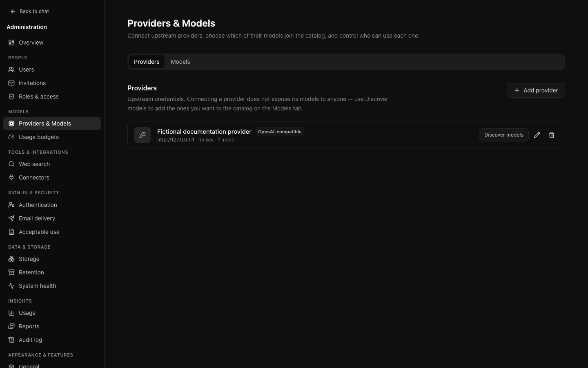
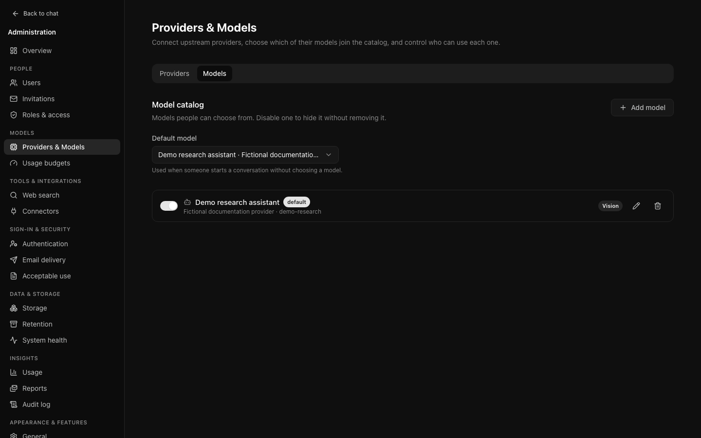

# Models and providers

Providers, the model catalogue, and the default model share one page,
**Models → Providers & Models** (`/admin/models`), with a **Providers** tab and a
**Models** tab. It opens on Providers; `/admin/models?tab=models` opens the
catalogue directly. The old `/admin/providers` address lands on the Providers tab.

## Providers hold credentials

A provider is an upstream service and the key used to reach it. Adding one makes
its models *available to add*; it does not expose anything to your users.

That separation is deliberate. A provider offering forty models should not
present forty to your institution — you choose which are appropriate and which
roles may use them.

### Credentials are write-only

Once saved, a key is encrypted and never returned. The form shows whether one is
set, not what it is. Replacing it means entering a new one; there is no way to
read the old value back, including for you.

Rotating `ENCRYPTION_KEY` in the environment makes every stored credential
unreadable and they must all be entered again. Do not rotate it casually.

## The model catalogue

Each entry maps a name your users see to an upstream model identifier.

### Discovering models

**Discover** asks the provider what it offers and lists what is not yet in your
catalogue. Faster than typing identifiers, and it will not silently add
anything.

### Fields that matter

- **Display name** — what appears in the picker. This is for your users, so
  "GPT-5.6 Luna" beats `gpt-5.6-luna-20260115`.
- **Description** — shown on the model's information card. Worth writing. Left
  blank, the interface falls back to listing capabilities, which tells somebody
  what the model *can do* but not when to reach for it.
- **Capabilities** — vision, reasoning, tool calling, PDF comprehension and so
  on. These drive the picker's icons and its filter. **Getting them wrong is
  worse than leaving them blank**: somebody will attach a PDF to a model that
  cannot read one and get a reply that never mentions it.
- **Visible to roles** — which roles see it. This is how an expensive model is
  kept to the people who need it.
- **Context window** — used to budget provider input. If unset, the application
  uses a 32,768-unit fallback. Keep it aligned with the upstream model.
- **Max output tokens** — reserved before input selection and explicitly passed
  on every request. If unset, the default is 4,096, or one quarter of a smaller
  context window. A configured output cap that leaves no input space is rejected.

For budgeted Anthropic thinking models, the output limit includes both thinking
and the visible answer. The application allocates 10%, 30% or 60% to low, medium
or high thinking, with a 1,024-token minimum and some answer capacity retained.
The installed adapter adds thinking to its answer limit, so OCI subtracts it
from that SDK parameter first. Known adapter output ceilings are also respected.
Limits of 1,024 or less cannot enable legacy thinking: choose Instant or increase
the configured limit. Adaptive models keep the SDK's adaptive effort control.

### Input safety ceilings

Input selection reserves output space and a 512-unit framing margin, then keeps
a contiguous recent suffix of whole turns. Text is estimated conservatively from
UTF-8 bytes plus framing, not a provider-specific tokenizer. Images receive an
8,192-unit allowance each; provider-specific limits can still reject a request.

The application caps input at 128,000 estimated units, scans at most 129 recent
message descriptors to select at most 128 historical messages, and selects at
most 512 KiB of serialized stored message parts. File metadata is inspected
before contents are loaded. A request can include at most 32 files and 20 MiB of
image data in its selected context, independently of upload/storage limits.

Required latest-turn content, system instructions and current search grounding
are never silently shortened. Oversized required input is rejected before the
new prompt is persisted. Older history may be omitted, with a notice on the
reply. These are safety bounds, not precise token counts or latency measurements.

Ready payloads are immutable through normal application writes. Storage corruption
or out-of-band mutation is different: blob reads currently buffer before checking
actual length, and stored message reads check aggregate size after individually
bounded rows arrive. The acceptance limits are not hard peak-memory guarantees
when stored contents diverge from their inspected metadata.

### The default model

Chosen here, above the catalogue list. It is what a new conversation starts with
when somebody has not picked a model, so it should be something reasonable for
everyday work rather than your most capable option — everyone gets it by
default, including people who would not have chosen it.

Only models somebody could actually use are offered: enabled, on an enabled
provider. Choosing one clears the flag from every other model in the same
write, and concurrent changes are serialised, so exactly one model ends up as
the default. If the default stops being usable — disabled, its provider
disabled, or hidden from the `user` role — the page and the
[setup checklist](first-run.md#3-choose-a-default-model) say so.

## Embeddings

The **Embeddings** tab (`/admin/models?tab=embeddings`) turns on meaning-based
search for large [project files](../user/projects.md#large-projects). Without it,
a project too large to give the model whole is searched by keyword only. With
it, each passage is also turned into a vector (an *embedding*) once, and each
question as it is asked; the passages closest in meaning are merged with the
keyword results (reciprocal rank fusion), so a passage that answers a question
in other words is found while exact names and codes still rank first.

It needs two things:

- **pgvector in the database.** The tab shows whether the extension is not
  installed on the server, installed but not enabled, or enabled. OCI never
  enables it itself; an operator runs `CREATE EXTENSION IF NOT EXISTS vector;`
  once (see [Upgrading to v0.9](../OPERATIONS.md#upgrading-to-v09), including
  what to do if your PostgreSQL image does not include pgvector).
- **An embeddings model.** Choose an existing provider (OpenAI, Google or
  OpenAI-compatible; Anthropic has no embeddings) and enter the model id, such
  as `text-embedding-3-small` or, on a local server, `nomic-embed-text`.
  **Test model** embeds a sample and reports the vector size; saving a model
  does the same and records the size, which sizes the storage. A model that
  cannot embed the sample cannot be switched on.

Once both are in place, OCI creates its embeddings table and the
`projects.embed-passages` background job embeds existing passages, a bounded
batch every five minutes; new uploads embed their opening passages straight
away. The tab shows how many passages are embedded, and any files that failed
and are waiting to be retried. **System health** has a *Meaning-based search*
row with the same information.

**Relevance floor.** Passages less similar in meaning to the question than a
cosine similarity of 0.2 are left out, so a question the files do not cover
does not bring in the nearest passages anyway. What counts as unrelated depends
on the model: with OpenAI's `text-embedding-3` models or Cohere's embed-v3,
unrelated text scores below about 0.2 and the floor removes it; models such as
`nomic-embed-text` or `bge-m3` score even unrelated text above 0.3, so with
them the floor removes little and keyword search and reranking (which have
floors of their own) do the filtering. The value is fixed and deliberately
low, so a passage that answers a question is never dropped for scoring
slightly low.

**Changing the model** (or its size) re-embeds everything in the background.
Until a project's passages are embedded with the new model, its searches are
keyword-only. Switching meaning-based search off keeps the stored embeddings, so
switching it back on with the same model needs no re-embedding.

**Cost.** Embedding calls are recorded as usage under `embedding:<model id>`:
passages are charged to the file's owner, questions to the person asking. They
count tokens (and cost, if you set a **price** per million tokens; leave it
blank to record usage at no cost) but no messages, and they count towards
budgets that cover every model. A failed or slow embeddings call never fails a
reply: the reply is searched by keyword instead, and the failure is logged.

Changes here are audited as `embeddings.update` (with the previous and new
setting) and tests as `embeddings.test`. Auditors can see the tab but not
change it.

## Reranking

The **Reranking** section of the same tab adds an optional third stage to
[project-file search](../user/projects.md#large-projects). A reranking model (a
cross-encoder) reads the question together with each of the 40 best candidate
passages, after keyword search and, when it is on, meaning-based search, and
scores how well each one answers it. Passages are then given to the model in
that order, within the same share of its context. It is off by default and
**works with or without pgvector**: without meaning-based search it reranks the
keyword results.

Choose an existing provider and enter the reranking model id, such as
`bge-reranker-v2-m3` (BAAI), `jina-reranker-v2-base-multilingual` (Jina) or
`rerank-v3.5` (Cohere). **Test reranking** reranks a three-sentence sample and
reports how long it took; switching reranking on, or changing its provider or
model while it is on, does the same, and a model that cannot rerank the sample
cannot be switched on.

**Endpoint.** OCI calls the Cohere-compatible reranking API on the provider's
base URL with `/rerank` appended, so a base URL of `https://host/v1` is called
as `https://host/v1/rerank`. The section shows the resolved URL. The request is
`POST` with the provider's key as a bearer token and the JSON body
`{"model", "query", "documents": [...], "top_n"}`; the answer must list
`results` with an `index` and a `relevance_score` (or Hugging Face TEI's bare
list of `index` and `score`). Only OpenAI-compatible providers, and OpenAI
providers with a base URL (a gateway), are offered: OpenAI's own API,
Anthropic and Google have no Cohere-compatible reranking endpoint.

| Server | Base URL to configure | Notes |
| --- | --- | --- |
| LiteLLM gateway | `https://litellm.example.com/v1` (or without `/v1`) | Its `/rerank` route forwards to any reranker LiteLLM supports, including Cohere, Jina, Hugging Face TEI and vLLM. |
| vLLM | `http://vllm:8000/v1` | Serve a cross-encoder, for example `vllm serve BAAI/bge-reranker-v2-m3`. |
| Hugging Face TEI | through LiteLLM | TEI's own `/rerank` expects `texts` rather than `documents`, so put a LiteLLM gateway (or another Cohere-compatible proxy) in front of it. |
| Jina | `https://api.jina.ai/v1` | Model `jina-reranker-v2-base-multilingual`. |
| Cohere | `https://api.cohere.com/v2` | Model `rerank-v3.5`. Add it as an OpenAI-compatible provider with this base URL. |

**Relevance floor.** Rerankers on this API return a relevance score from 0 to
1, where unrelated text scores close to 0. Passages scored below **0.05** are
left out, with everything ranked after them; if none is above it, the reply
uses no passages from the project. A server that returns raw scores outside
0–1 (logits) is used to order the passages only, as before.

A reply waits at most **five seconds** for the reranker. A timeout or any error
keeps the previous order (fused, or keyword), is logged, and never fails the
reply; the reply's note then says nothing about reranking.

**Cost.** Each reranked message is one usage event of the person asking,
recorded under `rerank:<model id>` with no message counted and any tokens the
provider reports. It costs nothing unless you set a **price** per 1,000
searches (one search is one reranked message; Cohere, for example, charges per
1,000 searches).

Changes are audited as `reranking.update` (with the previous and new setting)
and tests as `reranking.test` (with the latency and endpoint). Auditors can see
the section, including the resolved endpoint, but not change it. The API is
`GET`/`PUT /api/admin/reranking` and `POST /api/admin/reranking/test`.

## A worked example: adding an expensive model for one group

The case is common: a capable, costly model that should not be available to
everybody.

1. **Add the provider**, if it is not already configured.
2. **Discover** its models and add the one you want.
3. Set **Visible to roles** to `admin` only, for now.
4. Confirm it appears in your own picker and answers correctly.
5. On [Authentication](identity.md#group-and-claim-mappings), map the group that
   should have it — say `oci-researchers` — to a role.
6. Add that role to the model's visibility.
7. Set a [usage budget](governance.md#usage-budgets) scoped to that model, so
   access does not mean unlimited access.

Step 7 is the one people skip. Visibility decides who *can* use a model; a
budget decides how much. Without it, restricting the model to a group only
narrows who can spend the budget, not how fast.
[Roles & access](governance.md#roles-and-access) shows how many models each role
can see, and which budgets apply to it.
