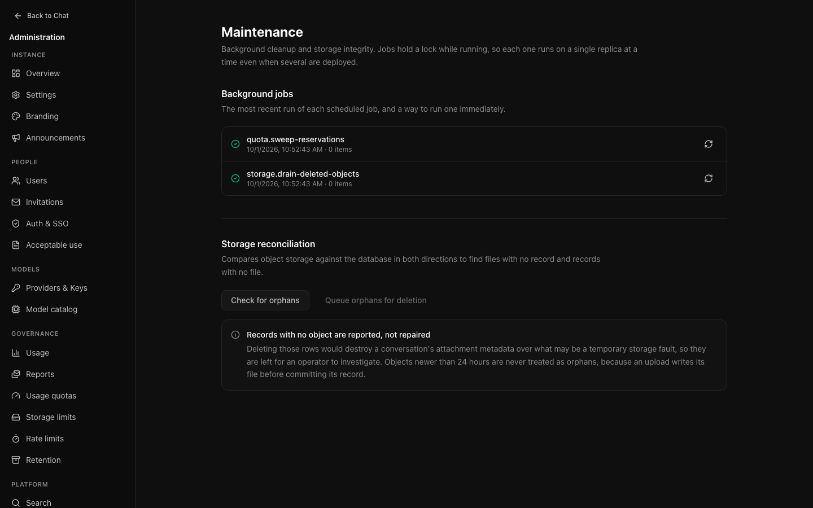

# Operations

Day-to-day running. For deployment and upgrades, see
[Operations](../OPERATIONS.md).

## Health

Whether the parts the instance depends on are working. Open this first when
something is reported.

| Check | Warns when | Fails when |
| --- | --- | --- |
| Database | Slow to respond | Not reachable |
| Redis | Not configured | Configured but unreachable |
| Model providers | — | None enabled |
| Models | — | None enabled |
| Background jobs | Failures in the last day | One started over an hour ago and never finished |
| Email delivery | Not configured | — |
| Attachment storage | Uploads never attached to a message | — |

The summary takes the worst individual result, so a green banner above a failing
row cannot happen.

**Redis absent is a warning, not an error.** Live replies still work, but stream
replay is unavailable and rate limits fall back to per-process enforcement.
Thread admission remains coordinated in PostgreSQL, including across replicas.
Redis is still important for shared rate limits, replay and cancellation.

Each of these previously surfaced as a user complaint. "Nobody can send a
message" is a page of red here, not a mystery.

## Storage

Where attachments live — a local path or an S3-compatible bucket — and what is
currently held.

**Test** checks the configuration actually works. Do this after any change; a
misconfigured bucket looks fine until somebody uploads a file.

**Reconcile** compares the database against what is really stored, and reports
disagreement. Worth running after restoring a backup, when the two can drift.

Uploads reserve their byte and file allowance in PostgreSQL before writing an
object. Unfinished uploads are hidden from attachment lists, but still reserve
space. Their objects are protected from orphan cleanup. Crashed or uncertain
uploads do not expire automatically; see [upload recovery](../OPERATIONS.md#recovering-an-interrupted-upload).
Deleting a file releases its allowance immediately, and restoring a conversation
requires enough allowance for its files.

The local path is shown but not editable: it has to exist inside the container,
so it stays deployment-managed. It is shown at all so you know which volume to
back up.

## Search

The provider used for web search grounding, and its key. Turning search off here
removes it from the composer entirely.

## Maintenance

The background jobs, and a way to run one now.

Jobs run on their own schedule. Running one by hand is for after you have
changed a setting it depends on and would rather not wait — retention, say, or
storage reconciliation.

Each running job holds a PostgreSQL session lock on a private connection.
Competing attempts skip while that lock is held, including repeated local timer
or manual requests. Run-record failures also release the lock.

This prevents overlapping runs while the owning database session is alive; it
does **not** guarantee one run per scheduled interval. Staggered replicas can
run sequentially. A lost database connection releases its lock but cannot cancel
external work already underway, so job side effects still need safe retries.

Conversation retention considers up to 500 eligible, unlocked threads per pass
and commits each thread separately. Busy accounts or threads are skipped. A failed
pass can have completed some threads; retrying continues with those still eligible
rather than repeating their storage adjustments.

`DATABASE_URL` must use a direct PostgreSQL connection or a session-mode pooler,
not transaction pooling. Budget one additional connection per concurrently
attempted job per API replica, separate from the regular application pool
(default ten connections). Private lock connections close after each attempt,
including when unlocking fails.

## When somebody reports a problem

1. **Health** — is something actually broken?
2. **The audit log**, filtered to their address — what did they do, and what
   happened?
3. **Their user detail** — are they at a limit? Do their sessions look right?
4. **Usage** — has something changed instance-wide, or is it only them?

That order goes from cheapest to most specific, and answers most reports before
step four.
