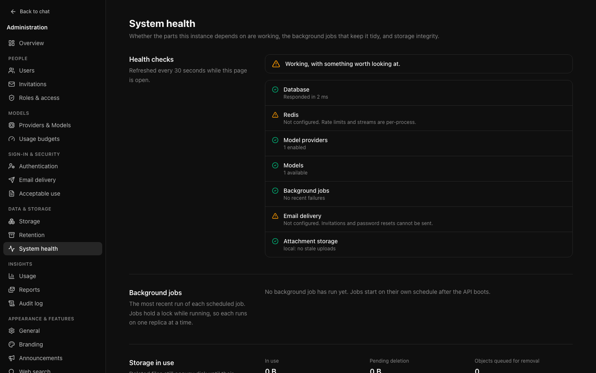
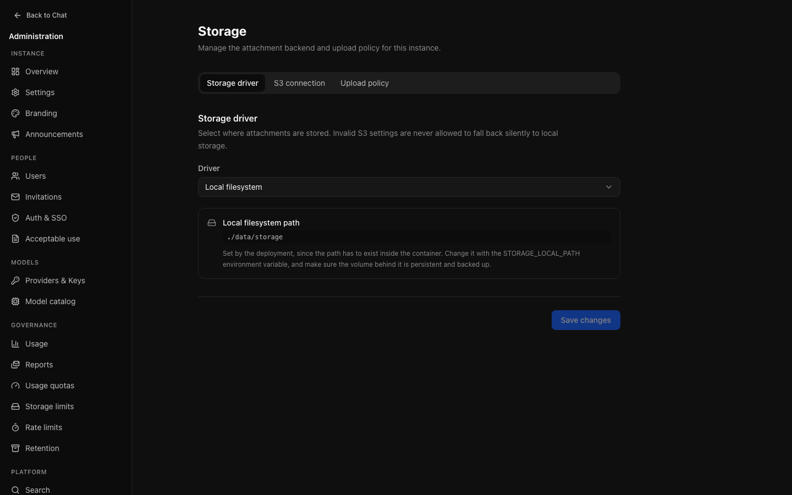
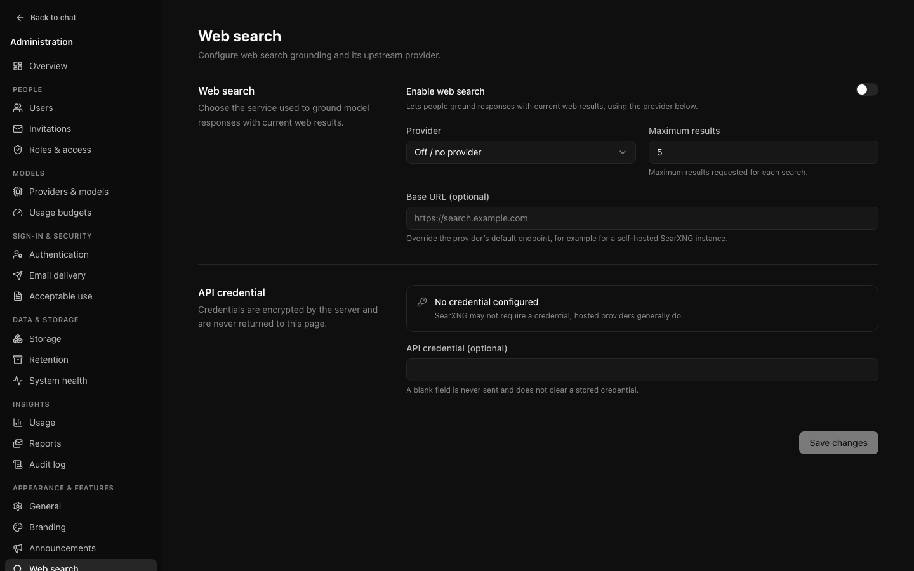

# Operations

Day-to-day running. For deployment and upgrades, see
[Operations](../OPERATIONS.md).

## Health

**Data & storage → System health** (`/admin/health`). Whether the parts the
instance depends on are working, the background jobs that keep it tidy, how much
storage is in use, and storage reconciliation. Open this first when something is
reported. The checks refresh every 30 seconds while the page is open; the old
`/admin/maintenance` address lands here.

| Check | Warns when | Fails when |
| --- | --- | --- |
| Database | Slow to respond | Not reachable |
| Redis | Not configured | Configured but unreachable |
| Model providers | — | None enabled |
| Models | — | None enabled |
| Background jobs | Failures in the last day | One started over an hour ago and never finished |
| Email delivery | Not configured, or the latest email failed (says how many since the last one delivered, when, and the mail server's reason); a delivered email, including **Send test email**, clears it | — |
| Attachment storage | Uploads never attached to a message that the hourly cleanup has not removed: it deletes uploads unsent for a day, so a warning means the cleanup is not running | — |
| Connectors | An enabled [connector](connectors.md)'s latest exchange failed | — |
| Backups | On, but no [backup](backups.md) completed in over a day, or objects were missing from the last one | The latest backup failed |
| Webhooks | An enabled [webhook](observability.md#webhooks) endpoint's latest delivery failed, or deliveries are over 15 minutes overdue | — |
| Background workers | — | No replica that runs background jobs (`OCI_ROLE=worker` or `all`) has checked in for a minute; see [process roles](../OPERATIONS.md#process-roles) |
| Read-only mode | [Read-only maintenance mode](maintenance.md) is on: says by whom (an administrator, a window or `OCI_READ_ONLY`), until when and why | — |
| Cache invalidation | Redis is configured but the replica answering does not hear other replicas' changes, so they reach it within 30 seconds instead of at once ([details](../OPERATIONS.md#settings-changes-and-other-replicas)) | — |

Below the checks, **Replicas** lists the API replicas heard from in the last
minute and whether each serves requests, runs background jobs, or both (shown
when Redis is configured). **Observability** reports whether [metrics and
traces](observability.md) are on. Both are set with environment variables, so
the page only shows them.

The summary takes the worst individual result, so a green banner above a failing
row cannot happen.

**Redis absent is a warning, not an error.** Live replies still work, but stream
replay is unavailable and rate limits fall back to per-process enforcement.
Thread admission remains coordinated in PostgreSQL, including across replicas.
Redis is still important for shared rate limits, replay and cancellation.

Each of these previously surfaced as a user complaint. "Nobody can send a
message" is a page of red here, not a mystery.

## Storage

Where attachments live — a local path or an S3-compatible bucket — and what is
currently held.

**Data & storage → Storage** (`/admin/storage`) has three tabs: the storage
driver, the S3 connection, and the upload policy. The upload policy's maximum
file size can be at most 1,024 MB (1 GB), the same ceiling as a role's per-file
[storage allowance](governance.md#storage-allowance), and the files per message
at most 20 (the default is 10). The count also bounds a single project upload.

**Test put/read/delete** on the S3 tab checks the saved S3 settings actually
work, and can be run while local storage is still active. Do this before
switching and after any change; a misconfigured bucket looks fine until somebody
uploads a file. Invalid S3 settings never fall back silently to local storage.

Reconciliation has moved to [System health](#storage-reconciliation).

Uploads reserve their byte and file allowance in PostgreSQL before writing an
object. Unfinished uploads are hidden from attachment lists, but still reserve
space. Their objects are protected from orphan cleanup. Crashed or uncertain
uploads do not expire automatically; see [upload recovery](../OPERATIONS.md#recovering-an-interrupted-upload).
Deleting a file releases its allowance immediately, and restoring a conversation
requires enough allowance for its files.

The local path is shown but not editable: it has to exist inside the container,
so it stays deployment-managed. It is shown at all so you know which volume to
back up.

## Web search

**Tools & integrations → Web search** (`/admin/search`). The provider used for
web search grounding, its credential, and the one switch that turns search on or
off. There is no separate web search toggle among the General features any more.

Choose a provider and the page asks for exactly what it needs:

| Provider | Asks for | Where to find it |
| --- | --- | --- |
| SearXNG (self-hosted) | Its address | Your SearXNG instance, with JSON output enabled (`search.formats: [html, json]`). No key. |
| Tavily | API key | app.tavily.com, under API keys (starts with `tvly-`). |
| Brave Search | API key | The subscription token at api-dashboard.search.brave.com. |
| Exa | API key | dashboard.exa.ai, under API keys. |
| SerpApi (Google results) | API key | serpapi.com/manage-api-key (64 characters). Searches use SafeSearch. |
| SearchApi (Google results) | API key | The searchapi.io dashboard (24 characters). Searches use SafeSearch. |

SerpApi and SearchApi are different companies with similar names; a key from
one is rejected by the other. **Test search** tells you which way round it is.

Hosted providers use their own fixed endpoints, so they ask for no address. A
key belongs to one provider: switching provider removes the saved key, and the
page asks for the new provider's key before search can be switched on.

**Maximum results** is how many results each search asks for, from 1 to 20:
Brave and Tavily return no more than 20.

**Test search** runs one sample search with the provider and the key or address
on the page, saved or not, and says whether it worked or what the provider
replied, for example that it rejected the key. SearXNG has no key: a refusal
from it (HTTP 403) almost always means its JSON output is off, and the message
says to add `json` to `search.formats`. Nothing is saved, and each test
is recorded in the audit log as `search.test`: the provider, the outcome, the address
tried (for SearXNG) and, when it failed, the reason, never a key.

People are offered search only when it can actually run: the switch is on, a
provider is selected, and it has its key or address. Until all of those hold,
search is removed from the composer rather than offered and failing. The page
says whether search is set up, and why not. Set up means configured: only a
search shows that the provider answers, so use **Test search** after a change
to the provider.

### Fallback provider

A search that times out, cannot reach the provider or gets a server error
(HTTP 5xx) is tried once more. If it fails again and you have chosen a
**Fallback provider**, the same search goes to that provider instead. A
refused key, a used-up quota (HTTP 429) or another error you need to fix is
reported as it is and never passed to the fallback.

- The fallback has its own provider and asks for exactly what that provider
  needs: an address for SearXNG, a key for the others. Its key is stored
  encrypted and never shown again, like the first provider's; switching the
  fallback to another provider removes its saved key.
- It must be a different service: a hosted provider cannot be its own
  fallback, and a SearXNG fallback must be at a different address.
- With a fallback chosen, each attempt at the first provider waits at most
  8 seconds (15 without one), so the fallback still has time to answer; a
  search still gives up within about 25 seconds in all.
- The reply records which provider answered. Its search details say so, and a
  tool step that the fallback answered reads, for example, "Searched the web
  for 'library hours' · 5 results · via Brave Search (fallback)". When both
  fail, the error names both.
- **Test search** tests the fallback too, separately, and reports each result.
  The audit entry records both providers and outcomes.
- A fallback missing its key or address is not used. Search still works, and
  the [setup checklist](first-run.md) says why the fallback is not used.

Logs say which provider failed, how and when, and that a search fell back,
never the query or a key. The [metrics](observability.md#metrics)
`oci_web_searches_total` and `oci_web_search_duration_seconds` count searches
by provider, by primary or fallback, and by outcome.

## Maintenance

Read-only maintenance mode, background jobs and storage reconciliation, all on
[System health](#health). There is no separate Maintenance page any more.

### Read-only mode

**System health → Maintenance** puts the instance in read-only mode: reading,
searching, exporting and signing in keep working, every change is refused, on
every replica at once, and background jobs that write pause. Switch it on for
a window, schedule a window with an announcement ahead of it, or set
`OCI_READ_ONLY=true` in an emergency. See
[Read-only maintenance mode](maintenance.md).

### Background jobs

Every scheduled job, how often it runs, and its most recent run: when it
started, how long it took, how many items it processed, and any error. A job
that has not run since the instance was set up says **Not run yet**. **Run**
starts one now. When the jobs run on a separate worker, **Run** waits up to
5 seconds for the worker to take the request. If none takes it (a worker that
has just stopped or is restarting), the page says the job has not started, so
you can try again once **Background workers** is healthy. Once a job has
started, its row shows it running and is checked every few seconds until it
finishes, then shows how the run ended.

Which jobs are scheduled depends on the settings of the replicas that run
jobs (`OCI_ROLE=worker` or `all`), so the list shows theirs, as each reports
it in its heartbeat, rather than the settings of the replica serving the page.
On a deployment whose worker leaves `RUN_MIGRATIONS` off, for example,
`migrations.post-deploy` is not listed: post-deploy work is applied by
`migrate --post`, and asking to run that job says so instead of queuing a run
that no replica would take.

Jobs run on their own schedule. Running one by hand is for after you have
changed a setting it depends on and would rather not wait — retention, say, or
storage reconciliation.

Each running job holds a PostgreSQL session lock on a private connection.
Competing attempts skip while that lock is held, including repeated local timer
or manual requests. Run-record failures also release the lock.

This prevents overlapping runs while the owning database session is alive; it
does **not** guarantee one run per scheduled interval. Staggered replicas can
run sequentially. A lost database connection releases its lock but cannot cancel
external work already underway, so job side effects still need safe retries.

Conversation retention considers up to 500 eligible, unlocked conversations per
pass and commits each conversation separately. Busy accounts or conversations are
skipped. A failed pass can have completed some conversations; retrying continues
with those still eligible
rather than repeating their storage adjustments.

Conversation summaries (`chat.compact-conversations`) are queued per
conversation. Besides the scheduled pass, each request starts a pass at once in
the API process that received it; both claim a conversation's request with a
15-minute lease, so replicas never summarise one conversation twice and a
request left by a restart is taken over when its lease runs out. A failed
summary is retried after 1, 5 and 30 minutes, then dropped; one waiting for a
spent allowance is checked every 15 minutes for a day.

`DATABASE_URL` must use a direct PostgreSQL connection or a session-mode pooler,
not transaction pooling. Budget one additional connection per concurrently
attempted job per API replica, separate from the regular application pool
(default ten connections). Private lock connections close after each attempt,
including when unlocking fails.

### Storage reconciliation

Compares object storage against the database in both directions. **Check for
orphans** reports objects with no record and records with no object; **Queue
orphans for deletion** then hands the orphaned objects to the cleanup job. Worth
running after restoring a backup, when the two can drift.

Records with no object are reported, not repaired: deleting them would destroy a
conversation's attachment metadata over what may be a temporary storage fault.
Objects newer than 24 hours are never treated as orphans, because an upload
writes its file before committing its record. [Backups](backups.md) kept in the
attachment bucket (under `.oci-backups/`) are never treated as orphans either.

Above it, **Storage in use** shows live bytes and files, what is in the trash,
and how many objects are queued for removal.

## When somebody reports a problem

1. **System health** — is something actually broken?
2. **The audit log**, filtered to their address — what did they do, and what
   happened?
3. **Their user detail** — are they at a limit? Do their sessions look right?
4. **Usage** — has something changed instance-wide, or is it only them?

That order goes from cheapest to most specific, and answers most reports before
step four.
