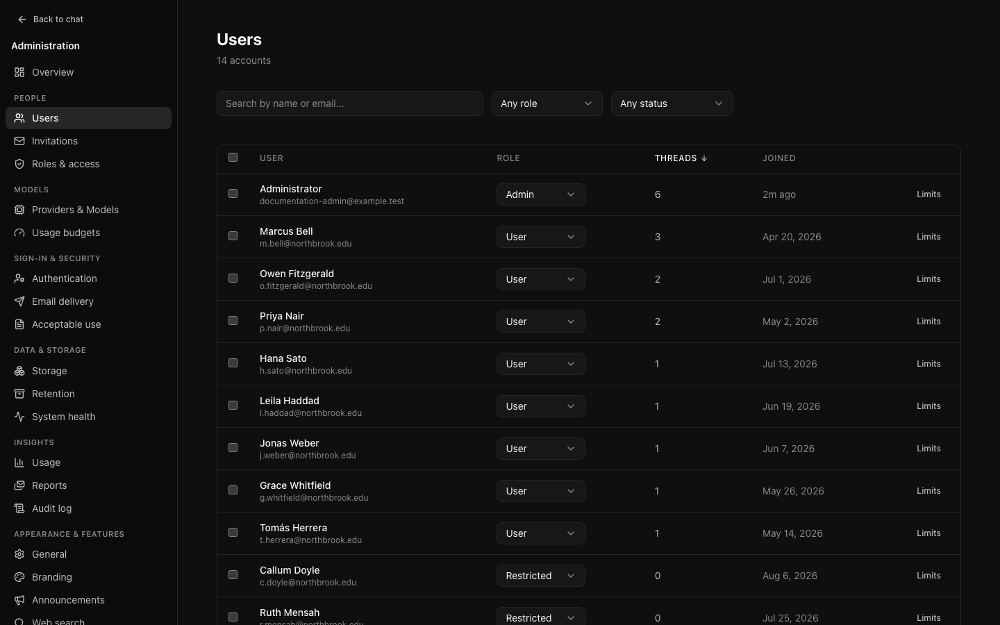
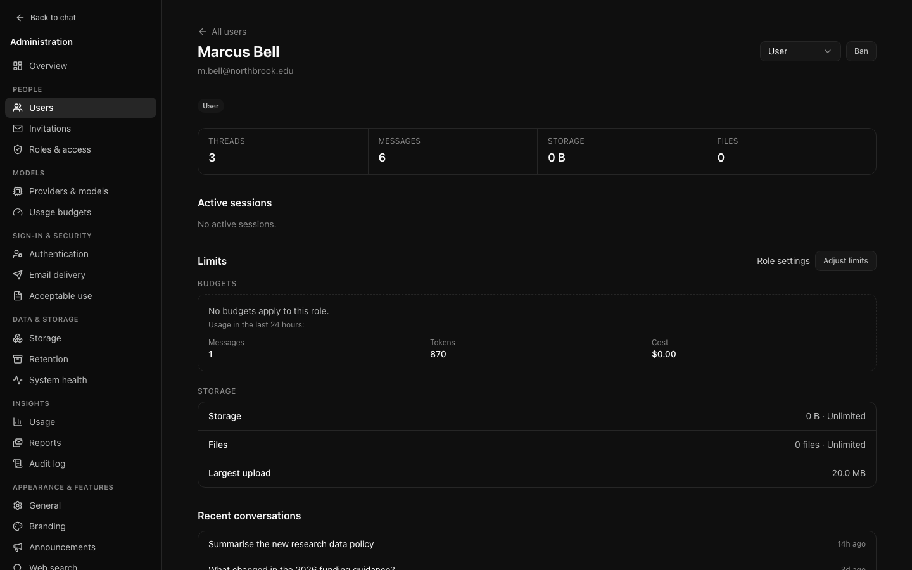
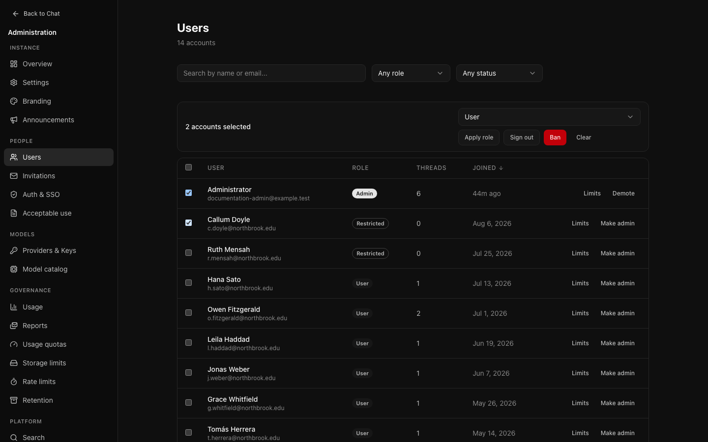
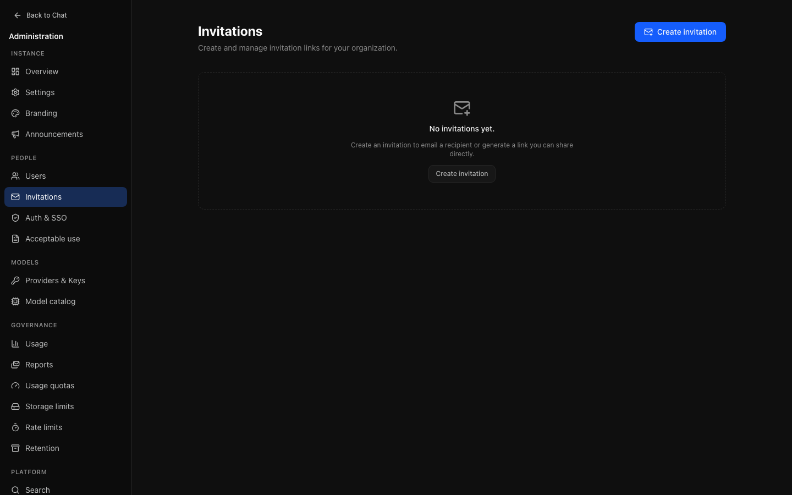

# People

## Finding somebody

Search matches names and email addresses; the filters narrow by role and by
status. All three are applied **on the server**, so they describe every account
rather than the page in front of you — which matters once the directory is
larger than one page.

Sorting works the same way. Sorting by **Conversations** finds the busiest people
across the whole instance, not the busiest fifty on this page.

The list can also be opened already filtered to one role: the people count on
[Roles & access](governance.md#roles-and-access) links here that way.

### Changing a role from the list

Each row has a role selector offering all four roles. A change applies as soon
as you pick it, except one that grants or removes administrator access, which
asks for confirmation first. You cannot remove your own administrator role: on
your own account the role control is disabled, with the reason beside it.

### Saved views

A set of filters you return to — "restricted accounts", "unverified" — saved by
name and shown as a chip above the list.

Views are **yours**, not the instance's. Two administrators looking at the same
directory rarely want the same slice of it, and "accounts I still have to
review" is a working note rather than configuration.

Auditors do not see saved views, the role selector, or the bulk action bar;
roles appear as plain labels.

## Looking at one person

The detail view answers the questions actually asked about an account: what they
have been doing, why they are hitting a limit, whether the account is behaving
oddly.

It shows their totals, storage, **active sessions with the address and client
each came from** (the ten newest, with the total above them, such as "Showing
the 10 most recent of 616 active sessions"), their limits, recent conversation titles, and their audit
trail — matched as actor, as target and among the accounts a bulk action named,
so something done *to* them appears beside things they did. Each entry says
which: "By Ama Okafor, to j.weber@…" for something they did to another account,
"To Ama Okafor, by admin@…" (or "by you") for something done to them. Searching the audit
log for their email finds the same entries, even after the account is deleted:
a role change, ban, unban, rename or sign-out records the account's email, and
the log's **Target** column shows it. **See every event for this account** opens the audit log
filtered to their address.

Conversation **titles only**. An administrator managing an account has no reason
to read its contents, and this page does not make that easy.

A person on [legal hold](compliance.md#legal-hold) is marked **Legal hold** here
and in the list, with the reason on this page. Their account cannot be deleted
until the hold is lifted.

### Actions

- **Role** — the same selector as the list, with the same confirmation for
  granting or removing administrator access.
- **Ban** asks for an optional reason, shown to administrators on the account.
  The server ends every session for the account as part of the ban, so they are
  signed out straight away: an open app goes to the sign-in page, which says
  they were signed out, and signing in says the account has been suspended
  (not the reason). You cannot ban yourself. **Unban** lifts it; they can then
  sign in again.
- **Removing the last administrator** is refused, whether by changing their
  role, banning them or deleting them, singly or in bulk: at least one
  administrator who can sign in always remains (a banned administrator does
  not count). Two administrators acting on each other at the same moment
  cannot both succeed; the second is refused.
- **Sign out everywhere** ends every session, and appears only when there is
  one to end. This is the right response to a suspected compromise; changing the
  password alone leaves existing sessions working. They can sign in again
  straight away.
- **Delete user**, at the bottom of the page, removes the account for good.
  See [Deleting an account](#deleting-an-account).

### Deleting an account

**Delete user** asks you to type the person's email address before the button
will do anything, so the wrong account cannot be deleted with a stray click.

Deleting is permanent. It removes the account and everything it owns: its
conversations and their messages, uploaded files (the stored files are removed
shortly after by the storage cleanup job), projects, artifacts, memory, share
links, connected accounts, saved views, limit overrides and preferences. The
person is signed out at once.

Kept: the **audit log**, including everything the person did (their entries
keep the email address they were recorded with) and a `user.delete` entry
naming the account and its role. Invitations and announcements they created
stay too. **Usage records** (messages, tokens and cost per model, daily
totals and limit refusals) are kept without anything that identifies the
person, so usage reports and budget history do not change; reports show them
as one **Deleted accounts** row (see
[Usage](audit-reporting.md#usage)). Only a run still in progress loses its
reserved allowance.

The server refuses:

- **your own account** — ask another administrator;
- **the last administrator** who can sign in — make somebody else an
  administrator first;
- a person on [legal hold](compliance.md#legal-hold) — lift the hold first.
  The dialog explains this and cannot be confirmed.

The reason is shown in the dialog. Auditors do not see **Delete user**. To stop
somebody signing in without losing their data, **Ban** them instead.

People can also delete their own account from Settings → Account when their
role allows it; see
[Self-service account deletion](governance.md#self-service-account-deletion).
That runs the same deletion, with the same refusals, and its `user.delete`
entry carries `self: true`.

### Limits

What this person is held to right now, computed by the same code that enforces
it:

- **Budgets** — each usage budget that applies, with what has been used, what
  remains, a progress bar, and when it resets. If no budget applies to their
  role, their usage over the last 24 hours is shown instead.
- **Storage** — bytes and files held against their role's allowance, and the
  largest upload allowed. Files in the trash are listed separately and do not
  count.

**Adjust limits** sets per-person budget overrides (see below). **Role
settings** opens [Roles & access](governance.md#roles-and-access) on their
role, which is where the defaults come from.

## Bulk actions

Select rows and the action bar appears. A role can be applied to the selection,
or the selection signed out or banned. Making accounts administrators, signing
them out and banning them ask first; afterwards the page says what was done,
such as "Signed out 2 accounts, ending 5 sessions."

Three behaviours worth knowing:

- **You cannot include your own account.** Selecting only yourself leaves the
  actions unavailable; selecting yourself alongside others skips you, and the
  bar, the confirmation and the result say so and count only the others.
  Locking yourself out mid-operation is not something the interface will help
  with.
- **A ban revokes sessions in the same action**, exactly as a single-account ban
  does.
- **The audit entry names every account affected**, by ID and email, not
  just a count, so the action can be checked afterwards.

Bounded at two hundred per request, so a single action cannot rewrite the
directory by accident.

## Invitations

When registration is invite-only or closed, an invitation is how somebody gets
an account. Each carries a role, so you decide what they will be before they
arrive.

Links expire after 7 days unless you choose another number (1–365), or clear
it for a link that never expires. An unused invitation can be revoked, which is
worth doing when somebody's circumstances change between offer and acceptance.

An address that already has an account cannot be invited (change the
account's role instead), and an address can have only one pending invitation
at a time: revoke it to send a new one, for example with a different role.
An invitation for an address can only be accepted with that address, so the
invitation page fills it in. When email verification is required, the new
account still verifies its address as any other does: whoever opens the link
could have been given it by hand.

Invitations need email to be configured. Without SMTP you can still create one,
but you will have to deliver the link yourself.

## Per-person limits

**Limits** beside an account in the list, or **Adjust limits** on their page,
sets a budget override for that individual without changing the policy for their
role.

This is the answer to "my work needs more than the standard allowance". Use it
rather than raising the limit for everybody, and set an expiry if the need is
temporary — an override with no end date is one nobody will remember to remove.

Storage allowance and rate limits are per role, not per person; change them on
[Roles & access](governance.md#roles-and-access).
