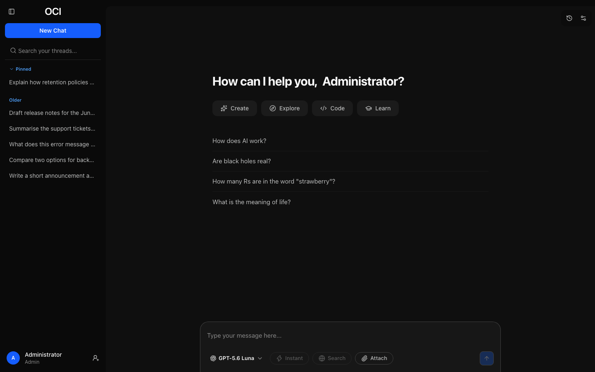
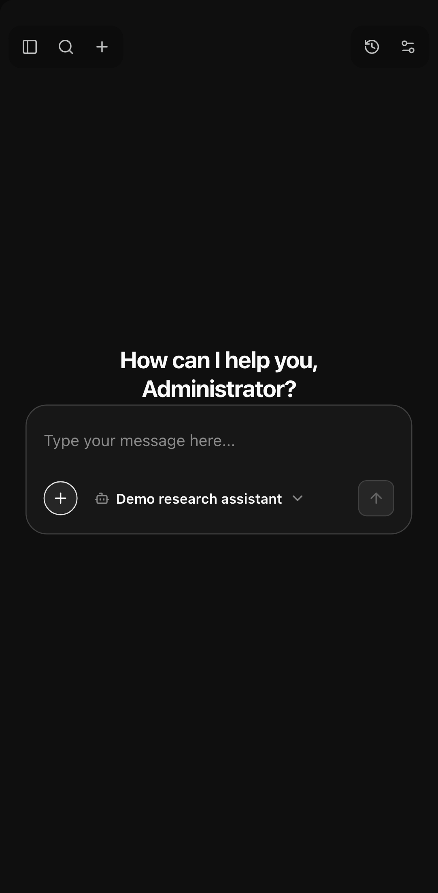

# Using Open Chat Interface

OCI puts several AI models behind one interface. Your institution decides which
models are available and how much you may use; everything else works the same
way regardless of which model you pick.

## Contents

1. [Getting started](getting-started.md) — signing in, the introduction, your
   first message.
2. [Conversations](conversations.md) — choosing a model, editing, branching,
   temporary chats.
3. [Attachments](attachments.md) — sending images and documents.
4. [Projects](projects.md) — grouping conversations under shared instructions
   and files.
5. [Searching the web](web-search.md) — grounding an answer in sources.
6. [Tools](tools.md) — tool steps in a reply, and approving actions.
7. [Artifacts](artifacts.md) — pages, images, diagrams and documents kept as
   versioned objects you can open, copy and download.
8. [Exporting as files](exporting.md) — saving a reply or a document as a Word
   document, PDF, presentation or spreadsheet.
9. [Connectors](connectors.md) — connecting your account to services models can
   use.
10. [Sharing](sharing.md) — publishing a conversation read-only.
11. [Settings](settings.md) — your account, password and devices, appearance and
    personalisation, history, models, attachments.
12. [Memory](memory.md) — notes about you that models can use in every
    conversation, and how to see, change and delete them.
13. [Limits](limits.md) — what a usage warning means and what to do about it.
14. [Your data](your-data.md) — exporting everything, and importing from ChatGPT
    or Claude.

## The parts of the screen

**The sidebar** holds your projects, each with its own recent conversations,
and your other conversations, newest first, with pinned ones at the top. Search finds a conversation by its title or by what was said in it, and
opens it at the matching message.

**The composer** at the bottom is where you type. The controls along its edge
choose the model, turn web search on, and attach a file.

**The top right** holds your recent activity and the settings menu.

On a narrow screen the sidebar becomes a panel you open from the top left, and
the composer's controls collapse behind a single button.

## What your administrator controls

Several things you might expect to configure are decided for the whole
instance:

- **Which models appear** in the picker, and which are available to your role.
- **How much you may use**, whether that is measured in messages, tokens, or
  cost.
- **How long conversations are kept** before they are removed.
- **Whether attachments, web search, sharing, temporary chats, branching,
  projects, memory or artifacts are available**, for the whole instance or for
  your role.
- **Which tools models may use for your role**, and how many steps a reply
  may take.
- **Which reasoning levels you can choose**, and which one a new conversation
  starts at.

If something described here is missing from your instance, it has been turned
off rather than broken.
