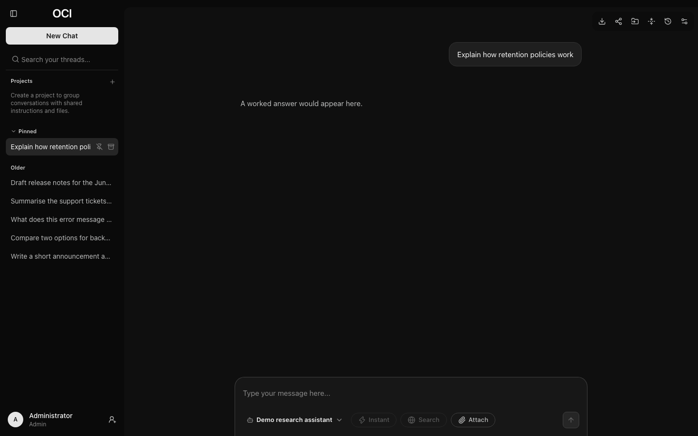

# Conversations

## What you can do to a message

Hovering over a message reveals its controls.

| Control | On | What it does |
| --- | --- | --- |
| **Copy message** | Either | Copies the text to your clipboard |
| **Edit message** | Yours | Rewrites your question and answers again |
| **Retry** | The latest reply | Answers the same question again, keeping the earlier reply |
| **Previous reply** / **Next reply** | The latest reply, once retried | Switches between the replies to your latest question |
| **Fork conversation here** | Either | Starts a separate conversation from this point |

Screen readers and voice control hear which message each control acts on, by
its opening words: **Copy message “Walk3 table: give me a small…”**, **Fork
conversation at “…”**. Code blocks and tables are numbered within their
message in the same way: **Copy code block 2 (Python)**, **Download table 1**.

### Editing, retrying and forking preserve the original

Editing creates a new conversation with your revised question; the original
stays as it was.

Retrying answers your latest question again, using the conversation up to that
question. The earlier reply is kept: below the latest reply, **‹ 2 / 3 ›**
shows which reply you are reading, and **Previous reply** and **Next reply**
switch between them (screen readers announce "Reply 2 of 3"). The reply you
leave showing is the one that counts: it is what the model sees as context for
your next question, and what exports, share links and search include. The other
replies stay stored but are left out of all of those. Every reply generated
still counts towards your usage.

You can retry and switch only on the latest reply, and not while a reply is
being generated. Once you ask another question, the reply showing becomes part
of the conversation. To take an earlier question in a different direction,
edit it or fork from it instead.

Forking copies the conversation up to the chosen point into a new one and leaves
the original untouched, so you can pursue an alternative without losing the
answer you already have. The new conversation is titled "Fork of" and the
original's title. Forked at one of your questions, it answers that question
again as it opens, as an edit does.

This is worth reaching for more often than people do. Asking "what if we did it
the other way?" as a fork means you end up with both answers side by side in
the sidebar rather than one overwritten by the other.

## How messages are formatted

Replies and your own messages are shown as Markdown: headings, lists, tables,
links and highlighted code blocks. A single line break starts a new line, so a
poem or an address keeps its lines; a blank line starts a new paragraph.

## How a reply shows the model's work

Some models work through a problem before answering, and some use tools (a
web search, an artifact, a connector). Everything a reply did before its
answer is gathered into **one collapsed block** at the top of the reply, so
the answer reads cleanly however many steps it took.

- A reply that only thought once shows a **Reasoning** heading. Select it to
  read the thinking in full.
- A reply that took more than one step, or used a tool, shows a one-line
  summary instead, for example **Thought · created an artifact**,
  **Thought · searched the web twice**, **Searched the web**, or
  **Worked · 3 steps** when it did several different things. Select it to see
  a timeline of every piece of reasoning and every tool step in the order
  they happened; each tool step expands to its inputs and result.

When you turn on **Search** and the model is not one that searches by itself,
OCI searches the web before the model answers. That search is the block's
first step, **Searched the web · 5 sources**, and the summary counts it
(**Searched the web · thought**, or **Searched the web** alone). Expand the
step to see the query, the search provider and every source with its
snippet; each source opens through the usual check for links that leave OCI.
Links a connector returned are a **Sources** step in the same block. A reply
therefore has at most one collapsed block above its answer.

What the work **made or needs from you** stays in sight below the block and
above the answer: artifact cards, tool approvals waiting for an answer, and
"Memory updated" notes. Nothing you need to act on is hidden in the
collapsed block.

While the model works, the block's heading says what it is doing now:
**Thinking…**, **Searching the web…**, **Writing *Title*…**. While it
thinks, a small window under the heading shows the latest few lines as they
arrive, so you can follow along without the reply jumping around; select the
heading or the window to read everything so far. When the answer starts, the
block collapses to its summary. If you opened or collapsed it yourself, it
stays the way you left it.

The heading is a button that says whether it is expanded, and the timeline
is a list. Screen readers hear each new step as it starts (once, not every
word); the moving window is not read out. Animation stops if your system asks
for reduced motion.

The same block appears when you reload a conversation, switch between
retried replies, and on share links (which show the tool steps' one-line
summaries, not reasoning).

Models that support **effort control** let you ask for more or less of this.
Higher effort means a slower, more considered answer; lower means a quicker one.
The control sits beside the model name when the chosen model offers it. It
starts at the level your administrator chose as the default (Instant unless
they changed it), and it lists only the levels your role may use.

## Temporary chats

A temporary chat stays off the sidebar, becomes unavailable when it expires,
and is removed by background cleanup. The instance still stores it while it is
active. Start one with the clock icon at the top right; if your role does not
have temporary chats, the icon is not shown.

Temporary does not mean trace-free: usage and audit records may remain, and the
model provider's retention policy still applies. Check your institution's data
policy before sending sensitive information.

## Switching model mid-conversation

You can change model at any point. The new model receives the recent conversation
context that fits its input budget, including eligible earlier attachments.

This is a practical way to work: start somewhere fast and cheap, and move to a
more capable model at the point the question turns difficult. Each reply records
which model produced it, so the conversation stays readable afterwards.

## Reconnecting to a reply

A live reply can usually reconnect, but its replay cache has a size limit and
expires. If replay fails, the app checks saved history for a known pending reply.
If the server cannot be reached (for example while it restarts), the page says
so and keeps checking, less often the longer it lasts (at most every 15
seconds), and shows the saved reply once the server answers.
You can also choose **Reload saved messages**. This does not resend a failed
request; copy any unsaved message text before replacing local history. A draft
you are typing stays in the composer during recovery.

A pending reply may still be running. You can wait or request **Stop**; a local
reader closing is not proof that the server stopped. After **Stop** the page
says **Stopping the reply…** until the server has saved it; the reply keeps
what was written and says you stopped it (or that you stopped it before it
began). Moving to another
conversation closes its browser reader without cancelling the server response.

Load failures show a retry or unavailable state rather than an empty chat.
A conversation, or the sidebar's projects, that could not load because the
server was briefly unreachable loads again by itself every few seconds for two
minutes, so you do not need to press **Retry** once the server is back.
A reply that failed says so in its place, with the reason and **Try again**,
both as it happens and after a reload.
Opening another conversation will not send a pending new-chat prompt there.

## What the model can see

The visible transcript is not always the entire input sent to a model. When a
conversation grows longer than the model can take in, its earlier messages are
summarised (see [Long conversations](#long-conversations)). If they cannot be,
older turns are left out to fit a bounded recent history, and a notice above
the reply says that earlier context was omitted. Either way, your stored
messages are not deleted or rewritten.

Your latest request, system instructions, selected attachments and any current
search grounding must fit together. If they do not, the request is refused
before a new user turn is saved. Shorten it, remove files, or choose a model with
more context. The application also has fixed safety ceilings, so choosing a
larger model does not remove every limit. One is the length of a single
message: up to 100,000 characters. The message box says so, and holds back
**Send**, as soon as a message is longer; attach long text as a file instead.

Whenever a message is refused like this, or because you are sending too quickly
or have reached a usage limit, it is not sent: its text goes back into the
message box and its files stay attached, so you can send it again once the
reason is dealt with. The conversation is left as it was. If it was the
first message of a new chat and you leave it without sending again, the empty
chat is removed rather than left in your history as "New Chat".

## Long conversations

When a conversation grows long, OCI summarises its earlier messages in the
background and from then on sends the model that summary followed by your most
recent exchanges, word for word, instead of leaving the earlier part out. A
quiet line appears above the first message the model still sees in full:
**Earlier messages are summarised for the model**. Select it to read the
summary the model receives.

- **It never stops you.** Summaries are made in the background, after a reply
  has finished. You can keep writing, sending, retrying, switching replies and
  answering approvals while one is being made; nothing waits for it and nothing
  is refused because of it.
- **Nothing is deleted.** Every message above the line stays in the
  conversation exactly as it was, and in search, exports and share links. Only
  what is sent to the model changes. A full export (Settings → Your data) also
  includes the summaries.
- **What the summary keeps:** the topic and your goal; facts, figures and
  decisions; your preferences and constraints; open questions and next steps;
  and details to keep exactly, such as names, numbers, code and quotations.
  Reasoning is not included, and long tool results are shortened.
- **When it happens:** after a reply, once the conversation takes up about
  three quarters of what the model can take in, so the summary is usually
  ready before it is needed. The most recent exchanges, up to about half of
  what the model can take in, are always kept in full, your latest exchange is
  never summarised, and a conversation is never cut in the middle of a
  question and its answer. A later summary builds on the previous one.
- **If a reply comes before the summary is ready** and the conversation no
  longer fits, that reply is sent the most recent exchanges that fit, without
  the oldest ones, and says that earlier context was left out (as before
  summaries existed). The same happens, once, if the model's provider reports
  that the input was too long: the reply is tried again with fewer earlier
  exchanges.
- **It counts towards your usage.** The summary is written by the
  conversation's own model, like a reply. When your usage allowance is spent,
  no summary is made; OCI tries again later.
- **Summarise it yourself.** **Summarise earlier messages now** (the folding
  icon at the top right of a conversation) asks for a summary straight away,
  keeping at most the latest half. You can say what the summary should keep,
  for example "keep every figure in the budget". The dialog closes at once;
  while the summary is made, the icon shows **Summarising earlier messages…**
  and you can keep writing. Asking again meanwhile does not make a second one.
  It uses the model of the latest reply. A conversation needs at least two
  turns (since the last summary) first; until then the dialog says there is
  nothing to summarise yet.
- **If a summary you asked for fails,** a quiet note under the conversation
  says so and why: your usage allowance ran out, the model returned an error,
  the model took too long, or there was nothing to summarise by then. Select
  **Retry** to ask again with the same instructions, or **Dismiss**. The note
  goes away by itself when a later summary succeeds (OCI also retries a model
  error a few times in the background). Summaries OCI makes on its own are
  never reported: if one fails, the conversation simply carries on as before.
- **Forks and edits** carry the summary over when everything it covers was
  copied into the new conversation.

Your administrator can turn automatic summaries off; then earlier messages are
left out instead, as described above, and you can still ask for a summary
yourself.

### Very long conversations in the browser

A conversation opens at its **latest 100 messages**. Earlier ones load in
parts as you scroll up, without moving what you are reading; **Load earlier
messages** at the top does the same from the keyboard, and a screen reader
hears how many were loaded. Opening a conversation from search loads the
messages around the match and the latest ones; **Load more messages** fills
in between, and scrolling towards the gap fills it too.

Once a conversation is long, only the messages near what you are looking at
are drawn on the page, so even thousands of messages scroll smoothly and
replies stream as before. **Your browser's Find (Ctrl+F or Cmd+F) only finds
messages that are drawn**, which in a long conversation means those near the
view. To find something anywhere in a conversation, use
[conversation search](#finding-a-conversation) (the sidebar's search box, or
`Cmd/Ctrl + K`), which searches every message and opens the conversation at
the match. Exports and share links always contain the whole conversation.

## Organising the sidebar

The sidebar lists your [projects](projects.md#projects-in-the-sidebar), each
with its own conversations, and then your other conversations under **Pinned**,
**Today**, **Yesterday** and **Older**. A conversation in a project is listed
under its project, not in the date groupings.

- **Pin** a conversation to hold it at the top, above the date groupings.
  Pinned conversations are always listed under **Pinned**, including those in
  a project, which show the project's name after their title.
- **Rename** one with its pencil; see
  [Renaming a conversation](#renaming-a-conversation).
- **Archive** one to remove it from the list without deleting it. A notice
  confirms it, with **Undo**, for ten seconds; it stays while the pointer is
  over it or Undo has focus (Alt+T moves focus to notices). Archived
  conversations remain under [Settings → History](settings.md#history).
- **Search** finds conversations by title and by what was said in them,
  including those in projects. See
  [Finding a conversation](#finding-a-conversation).

## Renaming a conversation

A conversation is named automatically from your first message. To change the
name, point at the conversation in the sidebar and choose the pencil
(**Rename thread**), or, with the conversation open, choose the pencil at the
top right (**Rename conversation**). Type the new name and press Enter to save,
or Escape to leave it as it was.

Names are 1 to 200 characters; spaces at either end are dropped. The new name
shows straight away in the sidebar, in search and in
[Settings → History](settings.md#history).

## Finding a conversation

Type in the sidebar's search box, or press `Cmd/Ctrl + K`, to search your
conversations. Results show each conversation's title with the best-matching
lines underneath, matched words highlighted, best match first.

- Every word you type must appear, and each matches the start of a word:
  `migr plan` finds "migration planning". Punctuation and symbols are ignored.
- Search covers titles, your messages and the replies you were shown. It does
  not search reasoning, web search sources, or the contents of attached files.
- Archived conversations are included and marked **Archived**. Conversations
  in the trash and temporary chats are not.
- Choosing a result opens the conversation at the matching message, briefly
  highlighted, instead of at the end. **Jump to latest** takes you to the end.

## Where conversations go

Your institution may set a retention period, after which conversations are
removed automatically. Conversations it removes go to the trash first, where
[Settings → History](settings.md#history) shows them as removed automatically
and when each will be deleted.

Deleting a conversation yourself moves it to a recoverable state first, so an
accidental deletion is not immediately final. How long that lasts is set by your
administrator.
