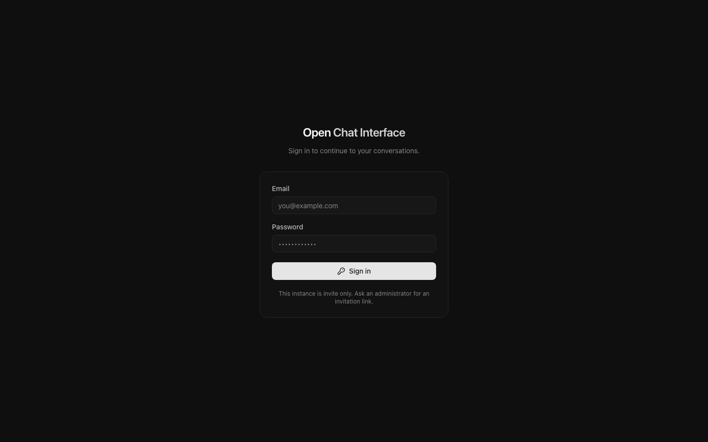
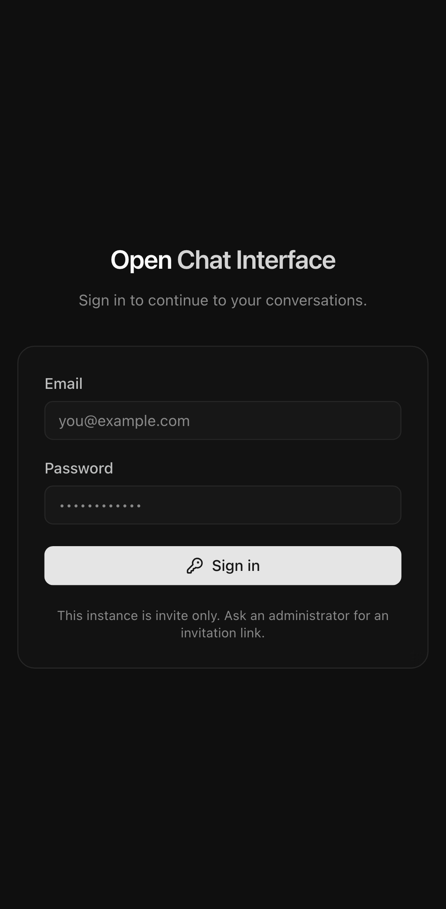
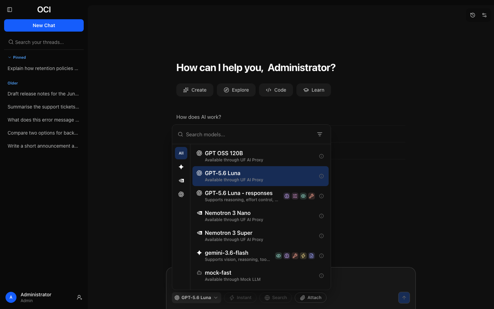
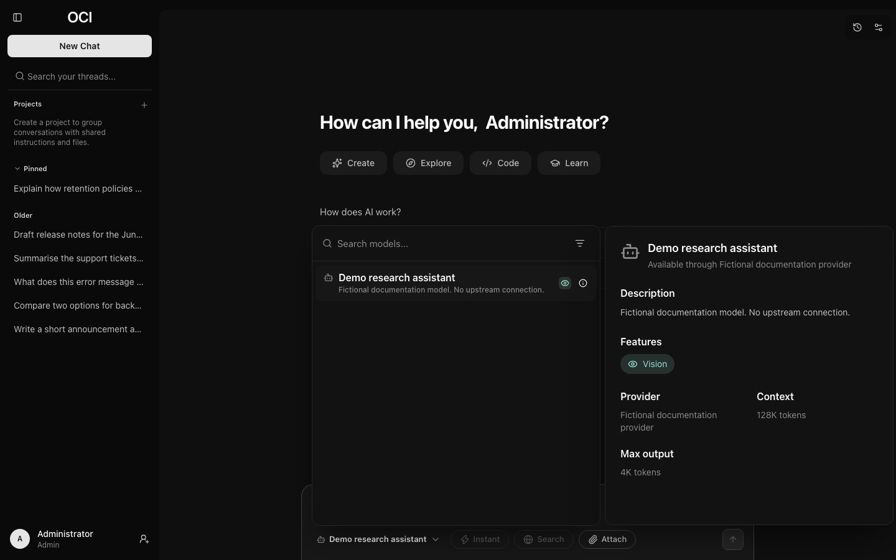

# Getting started

## Signing in

How you sign in depends on how your institution set the instance up. You will
see one of these, or both:

- **Email and password**, if the instance keeps its own accounts.
- **A button naming your organisation's identity provider** — "Continue with
  Northbrook SSO", or similar. This is the usual arrangement at an institution,
  and it uses the same credentials as everything else you sign in to.

On a phone the same page is laid out for a narrow screen.

Some instances go straight to the identity provider without showing this page
at all. If that happens and the provider is not working, adding `?local=1` to
the sign-in address brings the form back.

### If you are refused

Three refusals mean different things:

- **"Your account is not authorised to use this application"**, or wording your
  administrator chose, means you authenticated correctly but are not in a group
  that has been granted access. Ask whoever administers the instance to add
  you; they cannot see that you tried unless they look.
- **"Check your email and password"** means the credentials themselves were
  wrong. Note that a nonexistent account and a wrong password produce the same
  message, deliberately, so this does not confirm whether an account exists.
- **"This account has been suspended"** means an administrator has suspended
  (banned) the account. Ask them if you think it is a mistake.

If your session ends while the app is open (an administrator suspends the
account or signs it out everywhere, or you sign out every other device from
somewhere else), the next thing you do takes you to the sign-in page, which
says you were signed out.

### If you forget your password

**Forgot your password?** on the sign-in page emails you a link to choose a new
one, if the instance can send email. Choosing a new password this way signs
your account out everywhere, including any device you have lost; sign in again
with the new password.

## The introduction

A new account is greeted by a short introduction asking your name, what you do,
and how you would like replies written.

Everything it asks feeds the instructions sent with each of your messages, which
is the only reason it asks. Naming your field means you will not have to explain
it every time; choosing "concise" means you stop receiving five paragraphs when
one would do.

It is genuinely optional. **Skip for now** dismisses it, and everything it asks
can be set later under [Settings → Customisation](settings.md#customisation).

## An acceptable use policy

If your institution has published one, you will be asked to accept it before
you can use the instance. This is not dismissable.

Should the policy be revised later, you will be asked again, and told that it
has changed rather than being shown it as though it were new.

## Your first message

Type into the composer and press Enter. Shift+Enter starts a new line instead
of sending.

The reply streams in as it is generated. You can stop it partway if it is
clearly going somewhere unhelpful — you do not have to wait for an answer you
have already decided against.

The conversation is given a title automatically from what you asked, and
appears in the sidebar. To rename it, point at it in the list and choose the
pencil (**Rename thread**), or use the pencil at the top right of the open
conversation; see [Renaming](conversations.md#renaming-a-conversation).

## Choosing a model

The model name sits at the bottom left of the composer. Clicking it opens the
picker.

Models differ in what they can do, not merely in quality. The coloured icons
beside each name show its abilities at a glance:

| Icon | Ability | Means |
| --- | --- | --- |
| Eye | Vision | Can look at images you attach |
| Brain | Reasoning | Works through a problem before answering |
| Sliders | Effort control | You can ask it to think harder or answer faster |
| Wrench | Tool calling | Can use tools such as web search |
| Lightning | Fast | Optimised for a quick reply |
| Document | PDF comprehension | Can read a PDF you attach |

The **i** beside a model opens a card describing it in full.

Filtering by ability is quicker than reading every entry when you know what you
need: the funnel beside the search box narrows the list to models that can, for
instance, read a PDF.

A model you pick applies to that conversation; reopening it later starts from
the model it last used. New conversations start from your default model and
reasoning level, which you can set under
[Settings → Models](settings.md#models) for every device, or from the
instance's default.

## Where to go next

- [Conversations](conversations.md) — editing, branching, and temporary chats.
- [Attachments](attachments.md) — if you want a model to read a document.
- [Limits](limits.md) — if you have seen a warning about usage.
