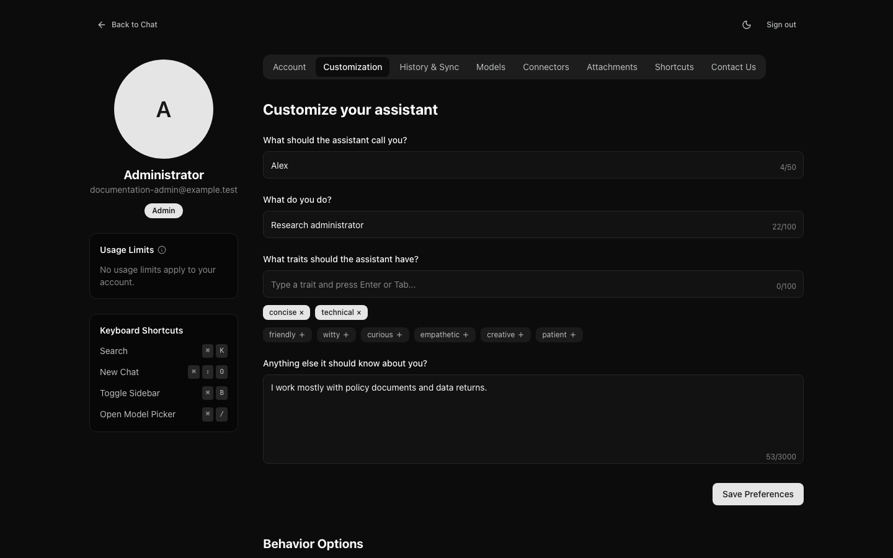
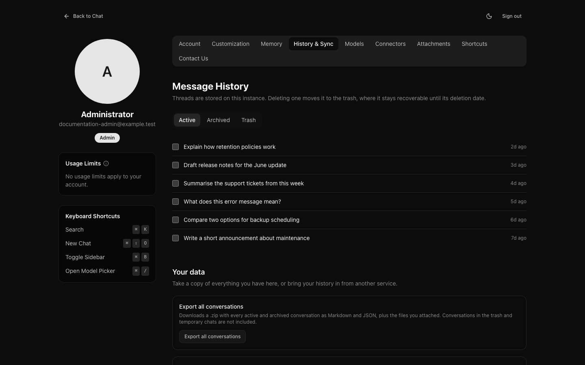
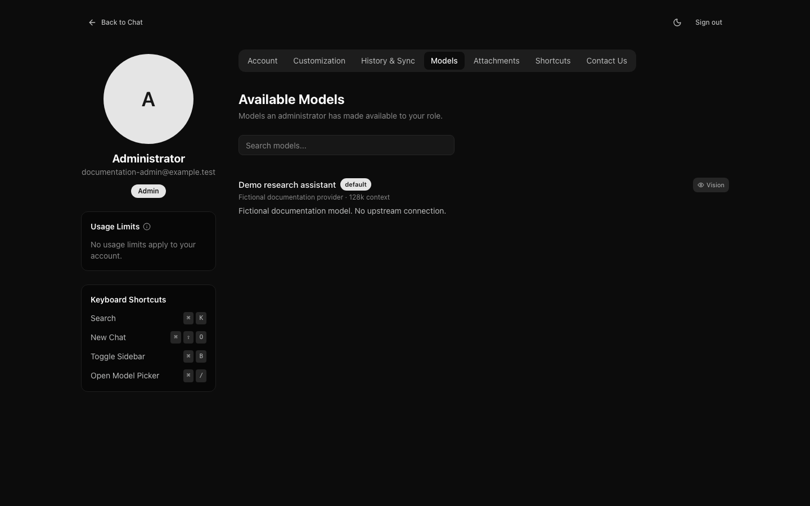
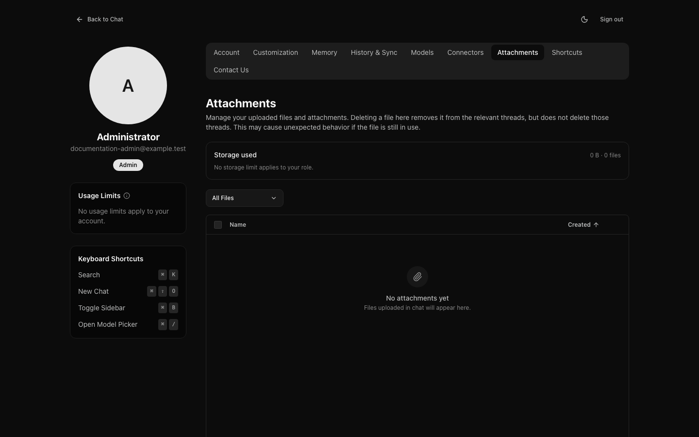

# Settings

Reach settings from your name at the bottom of the sidebar.

The sections are tabs across the top. Where they do not fit on one row, for
example on a phone, a **Settings section** menu takes their place.

A section with nothing in it for you is left out: **Memory** when your
administrator has not made memory available to you and you have no saved
notes, **Sharing** when you may not share and have no link left to revoke, and
**Connectors** when there is nothing for your role to connect. Their addresses
still open if you follow a link to one.

## Account

Your name, email address, role, and how you sign in.

- **Name.** If you sign in with an email address and password, **Edit** changes
  the name shown on this instance (1 to 100 characters). If you sign in through
  your organisation, your name and email address come from there and are
  marked as such.
- **Password.** **Change Password** asks for your current password and a new
  one of at least 12 characters. **Sign out of all other devices** is ticked by
  default, so a change made after losing a device locks it out; you stay
  signed in where you made the change. If you sign in through your
  organisation, your password is managed there instead. If your administrator
  has turned off email and password sign-in, the page says so and the password
  cannot be changed.
- **Devices.** **View Devices** lists where your account is signed in: the
  browser and system, a shortened network address, when each signed in, and
  when it was last active (to within five minutes). Your current device is
  marked **This device** and **Active now**.
  **Sign out** ends one other session; **Sign out all other devices** ends
  every session but this one. A device you sign out can stay signed in for up
  to five minutes.

You cannot change your email address yourself.

### Deleting your account

If your administrator allows it for your role, **Delete account** at the
bottom of the page deletes your account and everything it owns:
conversations and their messages, uploaded files, projects, artifacts,
memory, share links, connected accounts, saved views, limit overrides and
preferences. You are signed out straight away, and it cannot be undone. The
audit log keeps its entries, including one for the deletion, with your email
address; invites and announcements you created stay. Usage records (how many
messages and tokens you used with each model, and what they cost) are kept
without anything that identifies you, so your organisation's usage totals
stay accurate.

To confirm, type your email address and, if you have a password, enter it.
If you sign in through your organisation, there is no password to enter;
signing in that way again later creates a new, empty account.

The deletion is refused, with the reason, while your organisation has paused
deletion for your account (a legal hold), and if you are the last
administrator. Without the option, the page says **To delete your account,
contact your administrator**; an administrator can delete it under People.

## Customisation

What you set at the top is sent with every message, which is why it changes
replies without you repeating yourself.

- **What to call you** — used when a reply addresses you directly.
- **What you do** — saves explaining your field every time. "Research
  administrator" produces different examples from "undergraduate".
- **Traits** — how replies should read. "Concise" is the one most people want
  and few think to ask for.
- **Anything else** — free text. Format preferences belong here: "answer in
  bullet points", "always show your working", "British spelling".

Being specific pays off more than being thorough. Three precise sentences beat a
paragraph of generalities. **Save Preferences** becomes available once you have
changed something.

Further down are choices about the interface itself, all kept in this browser:

- **Appearance** — **Light**, **Dark**, or **System** to follow your device.
  The same choice is in the appearance menu at the top of a conversation and
  of Settings.
- **Invert Send/New Line Behavior** — normally `Enter` sends a message and
  `Shift + Enter` starts a new line. With this on, `Enter` starts a new line
  and `Cmd/Ctrl + Enter` sends. When you edit a message you have sent,
  `Enter` always starts a new line and `Cmd/Ctrl + Enter` submits.
- **Wrap Long Code Lines** — wraps code instead of scrolling it sideways.
- **Open artifacts automatically** (on by default) — opens the artifact panel
  beside the conversation when a reply starts writing a page, image, diagram
  or document, so you can watch it being written. It applies on wide screens
  only; see [Artifacts](artifacts.md).

## History

Your conversations, under **Active**, **Archived** and **Trash**, newest
activity first.

- Each title opens its conversation. A conversation in a project shows the
  project's name.
- **Search titles** narrows the list to conversations whose title contains what
  you type. To search what was said in them, use the sidebar's search; see
  [Finding a conversation](conversations.md#finding-a-conversation).
- The list shows 50 conversations at a time; **Load more** adds the next 50.
- Tick conversations, or use **Select all** to tick everything listed, then
  **Archive** or **Delete** them. Deleting moves them to the trash, where they
  stay recoverable until their deletion date.

Two buttons at the top handle all of your data at once:
**Export all conversations** downloads your conversations and files, and
**Import from ChatGPT or Claude** brings history in from those services. An
import carries on if you close its window. See [Your data](your-data.md).

## Memory

Your own switch for memory, and every note OCI keeps about you, to add, edit
and delete. See [Memory](memory.md).

## Models

**Defaults** sets where new conversations start, on every device you use:

- **Default model** — one of the models your role may use, or **Instance
  default** to follow the model your administrator marked as the default.
- **Default reasoning level** — the levels your role may use that the default
  model offers, or **Instance default**. On a model with other levels, the
  composer uses the nearest one the model has; on a model with none, the
  setting waits for one that has.

**Save defaults** stores them with your account. A conversation starts from
the model and level you picked in it, or last used in it; a new one starts
from your defaults, then the instance's. Picking a different model or level
in a conversation changes that conversation only.

If your administrator later hides your default model or withdraws your level,
new conversations quietly start from the instance default instead, and this
page says so until you choose again.

Below, **Available models** lists which models you can use and what each can
do, marked **instance default** and **your default**. This mirrors the picker,
with room to read the descriptions properly. You cannot add models here.
Which appear is decided by your administrator, and may depend on your role.

## Sharing

Every public link you have made to a conversation, newest first, 50 at a time
(**Show more** adds the next 50): the conversation (a link to it), whether the
link is **Live** or a **Snapshot**, whether it is **Active**, **Expired** or
**Revoked**, when it was created, when it expires, and how many times it has
been viewed. A conversation in the trash, or a temporary chat that has
expired, is marked as such.

**Revoke** takes one link down and **Revoke all** takes down every link not
yet revoked, expired ones included; each asks you to confirm first. Both work
even when your administrator has turned sharing off for you, so you can still
withdraw links you made before. See [Sharing a conversation](sharing.md).

## Connectors

Services that need your own sign-in before models can use their tools, with
**Connect** and **Disconnect**. See [Connectors](connectors.md).

## Attachments

Everything you have uploaded, in chats and to [projects](projects.md), and how
much space it occupies. **Storage used** shows the total against any limit for
your role, broken down into chat files, project files and artifacts.

Delete chat files you no longer need: this is what frees space against a
storage limit. Deleting a file removes it from its conversations, which stay,
and models can no longer read it there. Project files show the project they
belong to; open the project to delete them.

## Keyboard shortcuts and help

Every settings page shows your usage limits, a **Keyboard Shortcuts** card and
a **Need help?** card: beside the page on a wide screen, below it on a narrow
one. The send and new-line keys in the card follow **Invert Send/New Line
Behavior**, and the card shows `⌘` on a Mac and `Ctrl` everywhere else. The
shortcuts worth learning:

| Shortcut | Does |
| --- | --- |
| `Cmd/Ctrl + K` | Search and commands |
| `Cmd/Ctrl + Shift + O` | New conversation |
| `Cmd/Ctrl + B` | Show or hide the sidebar |
| `Cmd/Ctrl + /` | Open the model picker, with its search ready for typing |
| `Enter` | Send the message (`Cmd/Ctrl + Enter` when inverted) |
| `Shift + Enter` | Start a new line (`Enter` when inverted) |

The first four work anywhere in the chat — a new chat, a conversation or a
project, though not in Settings or Admin — including while you are typing a
message, but not while an input method is composing text. Use `Cmd` on a Mac
and `Ctrl` elsewhere. `Cmd/Ctrl + /` needs a message box with a model picker (a
new chat or a conversation) and does nothing elsewhere.
Search (`Cmd/Ctrl + K`) lists the same shortcuts beside **New chat** and the
sidebar command.

For help with your account, contact the administrator who runs your instance.
